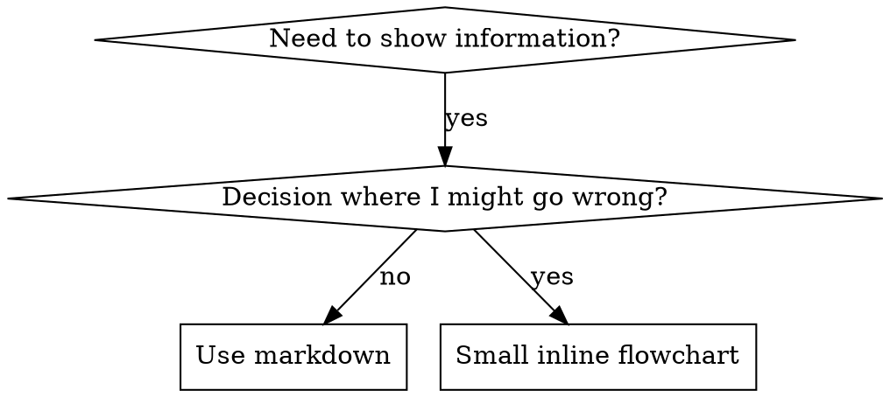

# Writing Skills

## Overview

A **skill** is a reference guide for proven techniques, patterns, or tools. Skills help future Claude instances find and apply effective approaches.

**Skills ALWAYS live at the project level (`./.pi/skills`), never in personal directories (`~/.pi/skills`).** Skills are project-specific and shared between developers across workstations.

**Official guidance:** For Anthropic's official skill authoring best practices, see [anthropic-best-practices.md](./anthropic-best-practices.md). This document provides additional patterns and guidelines.

**Skills are:** Reusable techniques, patterns, tools, reference guides

**Skills are NOT:** Narratives about how you solved a problem once

## When to Create a Skill

**Create when:**
- Technique wasn't intuitively obvious to you
- You'd reference this again across projects
- Pattern applies broadly (not project-specific)
- Others would benefit

**Don't create for:**
- One-off solutions
- Standard practices well-documented elsewhere
- Project-specific conventions (put in CLAUDE.md)

## Skill Types

### Technique
Concrete method with steps to follow (condition-based-waiting, root-cause-tracing)

### Pattern
Way of thinking about problems (flatten-with-flags, test-invariants)

### Reference
API docs, syntax guides, tool documentation (office docs)

## Directory Structure

**All skills live at project level:** `./.pi/skills/`

```
.pi/
  skills/
    skill-name/
      SKILL.md              # Main reference (required)
      supporting-file.*     # Only if needed
```

**Flat namespace** - all skills in one searchable namespace

**Separate files for:**
1. **Heavy reference** (100+ lines) - API docs, comprehensive syntax
2. **Reusable tools** - Scripts, utilities, templates

**Keep inline:**
- Principles and concepts
- Code patterns (< 50 lines)
- Everything else

## SKILL.md Structure

**Frontmatter (YAML):**
- Three fields supported: `name`, `description`, and `module`
- Max 1024 characters total for name + description
- `name`: Use letters, numbers, and hyphens only (no parentheses, special chars)
- `description`: Third-person, includes BOTH what it does AND when to use it
  - Start with "Use when..." to focus on triggering conditions
  - Include specific symptoms, situations, and contexts
  - Keep under 500 characters if possible
- `module`: Optional. Assigns the skill to a named module (see [Modules](#modules) below)

```markdown
---
name: Skill-Name-With-Hyphens
description: Use when [specific triggering conditions and symptoms] - [what the skill does and how it helps, written in third person]
module: module-name
---

# Skill Name

## Overview
What is this? Core principle in 1-2 sentences.

## When to Use
[Small inline flowchart IF decision non-obvious]

Bullet list with SYMPTOMS and use cases
When NOT to use

## Core Pattern (for techniques/patterns)
Before/after code comparison

## Quick Reference
Table or bullets for scanning common operations

## Implementation
Inline code for simple patterns
Link to file for heavy reference or reusable tools

## Common Mistakes
What goes wrong + fixes

## Real-World Impact (optional)
Concrete results
```

## Claude Search Optimization (CSO)

**Critical for discovery:** Future Claude needs to FIND your skill

### 1. Rich Description Field

**Purpose:** Claude reads description to decide which skills to load for a given task. Make it answer: "Should I read this skill right now?"

**Format:** Start with "Use when..." to focus on triggering conditions, then explain what it does

**Content:**
- Use concrete triggers, symptoms, and situations that signal this skill applies
- Describe the *problem* (race conditions, inconsistent behavior) not *language-specific symptoms* (setTimeout, sleep)
- Keep triggers technology-agnostic unless the skill itself is technology-specific
- If skill is technology-specific, make that explicit in the trigger
- Write in third person (injected into system prompt)

```yaml
# ❌ BAD: Too abstract, vague, doesn't include when to use
description: For async testing

# ❌ BAD: First person
description: I can help you with async tests when they're flaky

# ❌ BAD: Mentions technology but skill isn't specific to it
description: Use when tests use setTimeout/sleep and are flaky

# ✅ GOOD: Starts with "Use when", describes problem, then what it does
description: Use when tests have race conditions, timing dependencies, or pass/fail inconsistently - replaces arbitrary timeouts with condition polling for reliable async tests

# ✅ GOOD: Technology-specific skill with explicit trigger
description: Use when using React Router and handling authentication redirects - provides patterns for protected routes and auth state management
```

### 2. Keyword Coverage

Use words Claude would search for:
- Error messages: "Hook timed out", "ENOTEMPTY", "race condition"
- Symptoms: "flaky", "hanging", "zombie", "pollution"
- Synonyms: "timeout/hang/freeze", "cleanup/teardown/afterEach"
- Tools: Actual commands, library names, file types

### 3. Descriptive Naming

**Use active voice, verb-first:**
- ✅ `creating-skills` not `skill-creation`
- ✅ `debugging-async-tests` not `async-test-debugging`

**Gerunds (-ing) work well for processes:**
- `creating-skills`, `testing-skills`, `debugging-with-logs`
- Active, describes the action you're taking

**Name by what you DO or core insight:**
- ✅ `condition-based-waiting` > `async-test-helpers`
- ✅ `using-skills` not `skill-usage`
- ✅ `flatten-with-flags` > `data-structure-refactoring`
- ✅ `root-cause-tracing` > `debugging-techniques`

### 4. Token Efficiency (Critical)

**Problem:** Getting-started and frequently-referenced skills load into EVERY conversation. Every token counts.

**Target word counts:**
- Getting-started workflows: <150 words each
- Frequently-loaded skills: <200 words total
- Other skills: <500 words (still be concise)

**Techniques:**

**Move details to tool help:**
```bash
# ❌ BAD: Document all flags in SKILL.md
search-conversations supports --text, --both, --after DATE, --before DATE, --limit N

# ✅ GOOD: Reference --help
search-conversations supports multiple modes and filters. Run --help for details.
```

**Use cross-references:**
```markdown
# ❌ BAD: Repeat workflow details
When searching, dispatch subagent with template...
[20 lines of repeated instructions]

# ✅ GOOD: Reference other skill
Always use subagents (50-100x context savings). REQUIRED: Use [other-skill-name] for workflow.
```

**Compress examples:**
```markdown
# ❌ BAD: Verbose example (42 words)
your human partner: "How did we handle authentication errors in React Router before?"
You: I'll search past conversations for React Router authentication patterns.
[Dispatch subagent with search query: "React Router authentication error handling 401"]

# ✅ GOOD: Minimal example (20 words)
Partner: "How did we handle auth errors in React Router?"
You: Searching...
[Dispatch subagent → synthesis]
```

**Eliminate redundancy:**
- Don't repeat what's in cross-referenced skills
- Don't explain what's obvious from command
- Don't include multiple examples of same pattern

**Verification:**
```bash
wc -w skills/path/SKILL.md
# getting-started workflows: aim for <150 each
# Other frequently-loaded: aim for <200 total
```

### 5. Cross-Referencing Other Skills

**When writing documentation that references other skills:**

Use skill name only, with explicit requirement markers:
- ✅ Good: `**REQUIRED SUB-SKILL:** Use condition-based-waiting`
- ✅ Good: `**REQUIRED BACKGROUND:** You MUST understand systematic-debugging`
- ❌ Bad: `See skills/debugging/systematic-debugging` (unclear if required)
- ❌ Bad: `@skills/debugging/systematic-debugging/SKILL.md` (force-loads, burns context)

**Why no @ links:** `@` syntax force-loads files immediately, consuming 200k+ context before you need them.

## Flowchart Usage



**Use flowcharts ONLY for:**
- Non-obvious decision points
- Process loops where you might stop too early
- "When to use A vs B" decisions

**Never use flowcharts for:**
- Reference material → Tables, lists
- Code examples → Markdown blocks
- Linear instructions → Numbered lists
- Labels without semantic meaning (step1, helper2)

## Code Examples

**One excellent example beats many mediocre ones**

Choose most relevant language:
- Testing techniques → TypeScript/JavaScript
- System debugging → Shell/Python
- Data processing → Python

**Good example:**
- Complete and runnable
- Well-commented explaining WHY
- From real scenario
- Shows pattern clearly
- Ready to adapt (not generic template)

**Don't:**
- Implement in 5+ languages
- Create fill-in-the-blank templates
- Write contrived examples

You're good at porting - one great example is enough.

## File Organization

### Self-Contained Skill
```
defense-in-depth/
  SKILL.md    # Everything inline
```
When: All content fits, no heavy reference needed

### Skill with Reusable Tool
```
condition-based-waiting/
  SKILL.md    # Overview + patterns
  example.ts  # Working helpers to adapt
```
When: Tool is reusable code, not just narrative

### Skill with Heavy Reference
```
pptx/
  SKILL.md       # Overview + workflows
  pptxgenjs.md   # 600 lines API reference
  ooxml.md       # 500 lines XML structure
  scripts/       # Executable tools
```
When: Reference material too large for inline

## Modules

**Modules** group related skills and tools so they can be loaded/unloaded as a unit. This saves context by keeping irrelevant skills out of the system prompt until needed.

### How It Works

1. Add `module: <name>` to a skill's YAML frontmatter
2. Skills with the same module name are grouped together
3. The `/module` command controls which modules are active
4. **Unloaded** module skills are filtered from the system prompt and their tools are deactivated
5. **Skills without a module** are always visible — modules are opt-in
6. Module state persists across sessions

### When to Use Modules

- **Large projects** with many domain-specific skill groups (e.g., `design`, `deployment`, `testing`)
- **Context-heavy skills** that burn tokens when loaded unnecessarily
- **Tool bundles** where custom tools should only appear when relevant

Don't use modules for skills that are small and broadly applicable — just leave them unmodulated.

### Assigning a Skill to a Module

```yaml
---
name: writing-workflows
description: Use when writing workflow YAML files...
module: pi-development
---
```

### Tagging Tools to a Module

Extensions can tag their tools using the `moduleTag()` API from the modules extension:

```typescript
import { moduleTag } from "../modules/api.js";

pi.registerTool(moduleTag(pi, "design", {
  name: "design_review",
  // ... tool definition
}));
```

Tagged tools are deactivated when their module is unloaded.

### Module Commands

| Command | Description |
|---------|-------------|
| `/module list` | Show all discovered modules |
| `/module list <name>` | Show skills and tools in a module |
| `/module load <name>` | Activate a module |
| `/module unload <name>` | Deactivate a module |
| `/module status` | Show currently loaded modules |

### Naming Conventions

- Use lowercase with hyphens: `pi-development`, `data-processing`
- Group by domain/concern, not by skill type
- Keep module count manageable (5-10, not 50)

## Discipline-Enforcing Skills

Skills that enforce discipline (like verification requirements or mandatory review steps) need extra care to resist rationalization. Agents are smart and will find loopholes when under pressure.

**Psychology note:** Understanding WHY persuasion techniques work helps you apply them systematically. See [persuasion-principles.md](./persuasion-principles.md) for research foundation (Cialdini, 2021; Meincke et al., 2025) on authority, commitment, scarcity, social proof, and unity principles.

### Close Every Loophole Explicitly

Don't just state the rule - forbid specific workarounds:

```markdown
# ❌ BAD: Leaves room for interpretation
Validate output before delivering.

# ✅ GOOD: Closes loopholes explicitly
Validate output before delivering. No skipping validation.

**No exceptions:**
- Don't eyeball it and call it "validated"
- Don't assume small changes don't need validation
- Don't defer validation to a later step
- Validate means run the validator
```

### Address "Spirit vs Letter" Arguments

Add foundational principle early:

```markdown
**Violating the letter of the rules is violating the spirit of the rules.**
```

This cuts off entire class of "I'm following the spirit" rationalizations.

### Build Rationalization Tables

Anticipate excuses agents make and counter them explicitly:

```markdown
| Excuse | Reality |
|--------|---------|
| "Too simple to validate" | Simple changes break. Validation takes seconds. |
| "I'll validate at the end" | Errors compound. Validate after each step. |
```

### Create Red Flags Lists

Make it easy for agents to self-check when rationalizing:

```markdown
## Red Flags - STOP and Redo

- Skipped validation step
- "I already checked it visually"
- "This is different because..."

**All of these mean: Go back and run validation properly.**
```

## Anti-Patterns

### ❌ Narrative Example
"In session 2025-10-03, we found empty projectDir caused..."
**Why bad:** Too specific, not reusable

### ❌ Multi-Language Dilution
example-js.js, example-py.py, example-go.go
**Why bad:** Mediocre quality, maintenance burden

### ❌ Code in Flowcharts
```dot
step1 [label="import fs"];
step2 [label="read file"];
```
**Why bad:** Can't copy-paste, hard to read

### ❌ Generic Labels
helper1, helper2, step3, pattern4
**Why bad:** Labels should have semantic meaning

## Skill Creation Checklist

**Structure:**
- [ ] Name uses only letters, numbers, hyphens (no parentheses/special chars)
- [ ] YAML frontmatter with name, description (max 1024 chars), and optionally module
- [ ] Description starts with "Use when..." and includes specific triggers/symptoms
- [ ] Description written in third person
- [ ] Module assigned if skill belongs to a domain-specific group (see [Modules](#modules))
- [ ] Keywords throughout for search (errors, symptoms, tools)
- [ ] Clear overview with core principle

**Content:**
- [ ] Code inline OR link to separate file
- [ ] One excellent example (not multi-language)
- [ ] Small flowchart only if decision non-obvious
- [ ] Quick reference table
- [ ] Common mistakes section
- [ ] No narrative storytelling
- [ ] Supporting files only for tools or heavy reference

**For discipline-enforcing skills:**
- [ ] Loopholes explicitly closed
- [ ] Rationalization table included
- [ ] Red flags list included

**Quality:**
- [ ] SKILL.md body under 500 lines
- [ ] Token-efficient (no redundant explanations)
- [ ] Verified with real usage scenarios
- [ ] Consistent terminology throughout

## Discovery Workflow

How future Claude finds your skill:

1. **Encounters problem** ("tests are flaky")
2. **Finds skill** (description matches)
3. **Scans overview** (is this relevant?)
4. **Reads patterns** (quick reference table)
5. **Loads example** (only when implementing)

**Optimize for this flow** - put searchable terms early and often.
