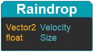
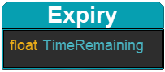

:::tip[Up to date]
This page is **up to date** for MonoGame.Extended `@mgeversion@`.  If you find outdated information, [please open an issue](https://github.com/monogame-extended/monogame-extended.github.io/issues).
:::

The Entities package is a modern high performance Artemis based Entity Component System. Many of the features found in this implementation were inspired by artemis-odb. Although, many others were also studied during development. As you'll see the systems are designed to feel familiar to MonoGame developers.

## What is an ECS?

An [Entity Component System (ECS)](https://www.gamedev.net/articles/programming/general-and-gameplay-programming/understanding-component-entity-systems-r3013) is a way to build and manage the entities (or game objects) in your game by composing their component parts together. An ECS consists of three main parts:

### 1. Components Overview

A component is a class that holds some _state_ about the entity. Typically, components are lightweight and don't contain any game logic. It's common to have components with only a few properties or fields. Components can be more complex but inheritance is not encouraged.

__Examples of Components are:__

|Component|Properties|
|----|----|
|Raindrop|**Vector2** Velocity, **float** Size|
|Expiry|**float** TimeRemaining|
|Transform2|**Vector2** position|
|Sprite|**Texture2d** image|

   


### 2. Entities Overview

An entity is a composition of components identified by an ID. Often you only need the ID of the entity to work with it. For performance reasons, an entity ID is only valid while the entity is alive. Once the entity is destroyed, it's ID may be recycled.  In Monogame.Extended, Entities are created for you when you call `CreateEntity` on the `World` instance.

### 3. Systems Overview

A system is a class that will run during the game's `Update` or `Draw` calls. They usually contain the game logic about how to manage a filtered collection of entities and their components. This is where the primary logic for functionality of an ECS lives.  

__Examples of Systems are:__

|System|Properties|
|----|----|
|ExpirySystem|Destroys an entity when the time has elapsed, using the Expiry Component assigned to that entity|
|RenderSystem|Controls the drawing of all entities, utilizing their components|
|PlayerSystem|Controls the updates to an entity, based on whatever components are part of that player entity|

## Where to start?

Since the `Systems` act upon the `Entities` set of `Components`, and the `world` controls which Systems are running, a good order would be to create them in this order
1. Components
2. Systems
3. World
4. Entities

## Components

Since this is just a class with data properties it can be anything.  It can even be a classes like the `Monogame.Extended.Transform2` or `Microsoft.Xna.Framework.Graphics.Texture2D`.  Generally you want your components to make up the individual pieces of an entity.  You need to decouple common functionality into individual grouped components.

Component Examples:
1. Positional information
2. Size information
3. Health information
4. Shield information

The reason is that you want your `Systems` to act upon all entities that have a that component.  Player characters, enemies, bullets, all have positional information.

The other beauty with separating out components this way, could be that you could later on decide you want bullets to potentially have a shield.  All you'd have to do is add the shield component to the bullet entity and all the functionality would be already built for you.

:::warning
Currently, there is a limit of 32 Components that can be returned by a ComponentMapper. You'll want to architect your game and components in a way that you do not go above that limit when using a ComponentMapper.
:::

### Creating a Component

Below are two example components.  In `Enemy`, it has a speed variable and a TimeLeft variable.  In `Raindrop`, it has a Velocity and Size.

```csharp
public class Enemy
{
    public float Speed = 100;
    public float TimeLeft = 1.0f;
}

public class Raindrop
{
    public Vector2 Velocity;
    public float Size = 3;
}
```

No logic is put into either component.  Notice that these are lacking a constructor.  In a pure ECS, these would all be structs only, it is possible to include a constructor if you wish.  

Below is an example with a constructor.  Notice there is still no logic, it's just setting the variables for us.

```csharp
public class Player
{
    public int Speed = 100;
    public Vector2 Position;

    public Player(int speed, Vector2 position)
    {
        Speed = speed;
        Position = position;
    }
}
```

## Systems

### Types of systems

Systems can be used to do all kinds of processing during your game. There are several kinds of base systems available to build your game.

- An `UpdateSystem` is a basic system that has an `Update` method called every frame.
- A `DrawSystem` is a basic system that has a `Draw` method called every frame.
- An `EntityUpdateSystem` is used to process a filtered collection of entities during the `Update` call.
- An `EntityDrawSystem` is used to process a filtered collection of entities during the `Draw` call.
- An `EntityProcessingSystem` can be used to process a filtered collection of entities one at a time during the `Update` call. 
- You can also create a system that has both an `Update` method and a `Draw` method by implementing the `IUpdateSystem` and `IDrawSystem` interfaces respectively.
- An `EntitySystem` is the base class for all entity processing systems. Typically you won't derive from this class unless you're building a new type of entity processing system. If you do derive from this class you probably also want to implement one of the update or draw interfaces.

### Creating systems

To create a new system, decide which base system to derive from and implement a new class.

```csharp
public class RenderSystem : EntityDrawSystem
```

When you're creating entity systems the first thing you'll want to do is provide an `Aspect` to filter the system to only process the entities you're interested in.

See the [Filtering components within a System](#filtering-components-within-a-system) for details on `Aspects`.

For example, a typical `RenderSystem` might want to process entities with a `Sprite` component and a `Transform2` component. To provide an aspect you pass it into the base constructor.

```csharp
private readonly SpriteBatch _spriteBatch;
private readonly GraphicsDevice _graphicsDevice;

public RenderSystem(GraphicsDevice graphicsDevice)
    : base(Aspect.All(typeof(Sprite), typeof(Transform2)))
{
    _graphicsDevice = graphicsDevice;
    _spriteBatch = new SpriteBatch(graphicsDevice);
}
```

Next, you'll need to override the `Update` or `Draw` method (depending on what type of system you're implementing).

In our case, the `Draw` method might look something like this:

```csharp
public override void Draw(GameTime gameTime)
{
    _spriteBatch.Begin();

    foreach (var entity in ActiveEntities)
    {
      // draw your entities
    }

    _spriteBatch.End();
}
```

In the code above, `ActiveEntities` will always contain only the entities filtered by the `Aspect`.

:::note
Don't forget to add your system to the `WorldBuilder` when you're done. See the World section for how.
:::

### Accessing components within a System

The preferred way to access components is to use component mappers.

#### Component Mapper
A `ComponentMapper` provides a very fast way to access components within a system. When you're using a component mapper you're getting nearly direct access to the underlying arrays that hold the components under the hood.

To get a component mapper, create a field on your system and use the `Initialize` method to grab an instance of the mapper. Do this for each component type you want to process.

```csharp
private ComponentMapper<Transform2> _transformMapper;
private ComponentMapper<Sprite> _spriteMapper;

public override void Initialize(IComponentMapperService mapperService)
{
  _transformMapper = mapperService.GetMapper<Transform2>();
  _spriteMapper = mapperService.GetMapper<Sprite>();
}
```

Then inside the `Update` or `Draw` method you can get access to the components for each entity you want to process.

```csharp
var transform = _transformMapper.Get(entityId);
var sprite = _spriteMapper.Get(entityId);

_spriteBatch.Draw(sprite, transform);
```

#### Put (Add components to an entity)
Component mappers can also be used to modify entities on the fly. For example, you can add a new component to an entity with the `Put` method.

```csharp
_buffMapper.Put(entityId, buffComponent);
``` 

:::note
The `Put` method will replace an existing component of the same type if it already exists. There is no need to check if the entity already has the component.
:::

#### Retrieving an Entity from a Component by the EntityID:

There are a few different ways to do this.  The recommended way is to use `TryGet`.  This reduces the code bloat from a null check or Has check.

```csharp
if(_buffMapper.TryGet(entityId, out Entity entity))
{
     // Do something with entity
}
```

This is essentially doing the same thing as either of these alternatives below.  Again, use the `TryGet` instead.

```csharp
if(_buffMapper.Has(entityId))
{
    Entity entity = _buffMapper.Get(entityId);
}

Entity entity = _buffMapper.Get(entityId);
If(entity != null)
{
     // Do something with entity
}
```
---

For convenience it's also possible to access components on an entity *without* using component mappers. This can be useful for prototyping ideas or when performance isn't a primary concern.

```csharp
var entity = GetEntity(entityId);
var health = entity.Get<HealthComponent>();
var transform = entity.Get<Transform2>();
```

:::warning
This method of accessing components requires dictionary lookups of the component types each frame. This is still a fairly fast operation, and for some games it'll do just fine.
:::

### Deleting Entities from a Component:

You can also `Delete` a component with the mapper.

```csharp
_buffMapper.Delete(entityId)
```

### Filtering components within a System

An `Aspect` is used by entity systems to decide what component types the system will process. The entities will be available in the system's `ActiveEntities` collection.

An aspect has three methods:

- `Aspect.All(A, B)` requires the entities to have all of the desired components (A AND B).
- `Aspect.One(C, D)` requires the entities to have any one or more of the components (C OR D OR BOTH).
- `Aspect.Exclude(E, F)` will exclude entities that have any of these components (NOT E OR F).

Aspects can also be chained together. For example, an entity matching:

`Aspect.All(A, B).One(C, D).Exclude(E)` would need to have A and B and at least one of C or D except if it has E.

## World

### Creating the world

The `World` is the entry point to the ECS. It holds your entities and systems and you'll use it later to create and destroy entities.

To create the world you need to use the `WorldBuilder` and add your systems before building the `World` instance.

Below is an example of how an ECS would be setup, each of the System classes would have to be written before calling AddSystem on them.

```csharp
// Class level definition
private World _world;

// In your LoadContent method
_world = new WorldBuilder()
    .AddSystem(new PlayerSystem())
    .AddSystem(new RenderSystem(GraphicsDevice))
    .Build();
```
:::note
Manually adding your systems this way might seem annoying at first, but it can be highly desirable to be able to control the order systems are added. It also allows you to constructor inject services as desired.
:::

Once the world is created you need to call the `Update` and `Draw` methods. 

```csharp
protected override void Update(GameTime gameTime)
{
    _world.Update(gameTime);
    base.Update(gameTime);
}
```

```csharp
protected override void Draw(GameTime gameTime)
{
    _world.Draw(gameTime);
    base.Draw(gameTime);
}
```

:::tip
The world also implements the `IGameComponent` interface, so if you prefer you can add it to the `GameComponentCollection` instead (not to be confused with ECS components).
:::


## Entities

## Overview of the Lifecycle of an Entity

1. Creation: `CreateEntity` creates an entity and how it does it by using the internal pooling and queues them
1. Activation: The following world update queued entities get activated and then the systems receive the entity added event.
1. Modification: changes through `Attach`, `Detach`, and component mapper methods trigger `EntityChanged`
1. Destruction: `DestroyEntity` queues it for removal
1. Cleanup: During the next world update the entity is removed triggering the `EntityRemoved` event and returned to the pool.

### Creating entities

Usually when you create an entity you'll want to attach some components to it immediately. This is not required though, as components can be added and removed anytime by systems.

```csharp
var entity = _world.CreateEntity();
entity.Attach(new Transform2(position));
entity.Attach(new Sprite(textureRegion));
```

Any standard class can be used as a component but typically you'll want to keep your components lightweight and specific.

:::info
An entity can only have one instance of each component type.
:::

### Destroying entities

Removing entities from the world is easy.

```csharp
_world.DestroyEntity(entity);
```

It should be noted that the actual entity creation and removal is deferred until the next update. This allows for some performance optimizations and batches events so that they can be handled more gracefully by systems.

:::note
When you're inside an `EntitySystem` there are helper methods for creating or destroying entities so that you don't need to access the `World` instance each time.
:::

## Examples

### Simple Example

This is the example from the Samples called "Entities".  It will allow you to control an image with your keyboards arrow keys.  All movement logic is done inside the PlayerSystem.cs file.

Start by following the getting started guide for a basic Monogame.Extended project.

Then inside the project create 2 folders, (Components, Systems).

Next we will create a single component for the position of the player.  We'll wrap in the speed also and just call it Player.  To do this, create a new class named `Player` and place it in the subfolder `Components`. In our examples we will use the root namespace Entities.  Use your root namespace instead.

```csharp
namespace Entities.Components
{
    public class Player
    {
        public int speed = 100;
        public Vector2 Position;

        public Player(int speed, Vector2 position)
        {
            this.speed = speed;
            this.Position = position;
        }
    }
}
```
Now lets create the 2 Systems Classes

PlayerSystem
```csharp
using Entities.Components;
using Microsoft.Xna.Framework;
using Microsoft.Xna.Framework.Input;
using MonoGame.Extended.ECS;
using MonoGame.Extended.ECS.Systems;

namespace Entities.Systems
{
    internal class PlayerSystem : EntityProcessingSystem
    {
        private ComponentMapper<Player> _playerMapper;

        public PlayerSystem() : base(Aspect.All(typeof(Player))) { }

        public override void Initialize(IComponentMapperService mapperService)
        {
            _playerMapper = mapperService.GetMapper<Player>();
        }

        public override void Process(GameTime gameTime, int entityId)
        {
            Player player = _playerMapper.Get(entityId);

            if (Keyboard.GetState().IsKeyDown(Keys.Left))
            {
                player.Position.X -= 5;
            }

            if (Keyboard.GetState().IsKeyDown(Keys.Right))
            {
                player.Position.X += 5;
            }

            if (Keyboard.GetState().IsKeyDown(Keys.Up))
            {
                player.Position.Y -= 5;
            }

            if (Keyboard.GetState().IsKeyDown(Keys.Down))
            {
                player.Position.Y += 5;
            }
        }
    }
}
```

RenderSystem
```csharp
using Entities.Components;
using Microsoft.Xna.Framework;
using Microsoft.Xna.Framework.Graphics;
using MonoGame.Extended.ECS;
using MonoGame.Extended.ECS.Systems;

namespace Entities.Systems
{
    internal class RenderSystem : EntityDrawSystem
    {
        private SpriteBatch _spriteBatch;
        private ComponentMapper<Texture2D> _textureMapper;
        private ComponentMapper<Player> _playerMapper;

        public RenderSystem(SpriteBatch spriteBatch)
            : base(Aspect.All(typeof(Texture2D), typeof(Player)))
        {
            _spriteBatch = spriteBatch;
        }
        public override void Draw(GameTime gameTime)
        {
            _spriteBatch.Begin();

            foreach (var entityId in ActiveEntities)
            {
                var texture = _textureMapper.Get(entityId);
                var player = _playerMapper.Get(entityId);
                _spriteBatch.Draw(texture, new Rectangle((int)player.Position.X, (int)player.Position.Y, 64, 64), Color.White);
            }

            _spriteBatch.End();
        }

        public override void Initialize(IComponentMapperService mapperService)
        {
            _textureMapper = mapperService.GetMapper<Texture2D>();
            _playerMapper = mapperService.GetMapper<Player>();
        }
    }
}
```

In your Game1.cs file:

Add the following using statements to the top
```csharp
using Entities.Components;
using Entities.Systems;
using MonoGame.Extended.ECS;
```

Add the following properties to the Game1 class
```csharp
private SpriteBatch _spriteBatch;
private World _world;
private Entity playerEntity;
```

Update your LoadContent Method to create the world, player entity, and load a texture.
```csharp
protected override void LoadContent()
{
    _spriteBatch = new SpriteBatch(GraphicsDevice);

    _world = new WorldBuilder()
        .AddSystem(new PlayerSystem())
        .AddSystem(new RenderSystem(_spriteBatch))
        .Build();

    playerEntity = _world.CreateEntity();
    playerEntity.Attach(Content.Load<Texture2D>("logo-square-128"));
    playerEntity.Attach(new Player(100, new Vector2(GraphicsDevice.Viewport.Width / 2, GraphicsDevice.Viewport.Height / 2)));
}
```

Add the world update to the Update method:
```csharp
_world.Update(gameTime);
```

Add the world draw to the Draw method:
```csharp
_world.Draw(gameTime);
```

That's it, you should have an image that can move around the screen using the ECS system that you can expand from here.

### Rain Example

In this example we are going to make a rain simulator.

We start by including the `Entities` namespaces.

```cs
using MonoGame.Extended.ECS;
```

Next, we create our `Expiry` and `Raindrop` components.

```cs
public class Expiry
{
    public Expiry(float timeRemaining)
    {
        TimeRemaining = timeRemaining;
    }

    public float TimeRemaining;
}
```
```cs
public class Raindrop
{
    public Vector2 Velocity;
    public float Size = 3;
}
```

Then we define our systems

```cs
public class ExpirySystem : EntityProcessingSystem
{
    private ComponentMapper<Expiry> _expiryMapper;

    public ExpirySystem() 
        : base(Aspect.All(typeof(Expiry)))
    {
    }

    public override void Initialize(IComponentMapperService mapperService)
    {
        _expiryMapper = mapperService.GetMapper<Expiry>();
    }

    public override void Process(GameTime gameTime, int entityId)
    {
        var expiry = _expiryMapper.Get(entityId);
        expiry.TimeRemaining -= gameTime.GetElapsedSeconds();
        if (expiry.TimeRemaining <= 0)
            DestroyEntity(entityId);
    }
}
```

```cs
public class RainfallSystem : EntityUpdateSystem
{
    private readonly FastRandom _random = new FastRandom();
    private ComponentMapper<Transform2> _transformMapper;
    private ComponentMapper<Raindrop> _raindropMapper;
    private ComponentMapper<Expiry> _expiryMapper;

    private const float MinSpawnDelay = 0.0f;
    private const float MaxSpawnDelay = 0.0f;
    private float _spawnDelay = MaxSpawnDelay;

    public RainfallSystem()
        : base(Aspect.All(typeof(Transform2), typeof(Raindrop)))
    {
    }

    public override void Initialize(IComponentMapperService mapperService)
    {
        _transformMapper = mapperService.GetMapper<Transform2>();
        _raindropMapper = mapperService.GetMapper<Raindrop>();
        _expiryMapper = mapperService.GetMapper<Expiry>();
    }

    public override void Update(GameTime gameTime)
    {
        var elapsedSeconds = gameTime.GetElapsedSeconds();

        foreach (var entityId in ActiveEntities)
        {
            var transform = _transformMapper.Get(entityId);
            var raindrop = _raindropMapper.Get(entityId);

            raindrop.Velocity += new Vector2(0, 500) * elapsedSeconds;
            transform.Position += raindrop.Velocity * elapsedSeconds;

            if (transform.Position.Y >= 480 && !_expiryMapper.Has(entityId))
            {
                for (var i = 0; i < 3; i++)
                {
                    var velocity = new Vector2(_random.NextSingle(-100, 100), -raindrop.Velocity.Y * _random.NextSingle(0.1f, 0.2f));
                    var id = CreateRaindrop(transform.Position.SetY(479), velocity, (i + 1) * 0.5f);
                    _expiryMapper.Put(id, new Expiry(1f));
                }

                DestroyEntity(entityId);
            }
        }

        _spawnDelay -= gameTime.GetElapsedSeconds();

        if (_spawnDelay <= 0)
        {
            for (var q = 0; q < 50; q++)
            {
                var position = new Vector2(_random.NextSingle(0, 800), _random.NextSingle(-240, -480));
                CreateRaindrop(position);
            }
            _spawnDelay = _random.NextSingle(MinSpawnDelay, MaxSpawnDelay);
        }
    }

    private int CreateRaindrop(Vector2 position, Vector2 velocity = default(Vector2), float size = 3)
    {
        var entity = CreateEntity();
        entity.Attach(new Transform2(position));
        entity.Attach(new Raindrop { Velocity = velocity, Size = size });
        return entity.Id;
    }
}
```

```cs
public class RenderSystem : EntityDrawSystem
{
    private readonly GraphicsDevice _graphicsDevice;
    private readonly SpriteBatch _spriteBatch;

    private ComponentMapper<Transform2> _transformMapper;
    private ComponentMapper<Raindrop> _raindropMapper;
    
    public RenderSystem(GraphicsDevice graphicsDevice)
        : base(Aspect.All(typeof(Transform2), typeof(Raindrop)))
    {
        _graphicsDevice = graphicsDevice;
        _spriteBatch = new SpriteBatch(graphicsDevice);
    }

    public override void Initialize(IComponentMapperService mapperService)
    {
        _transformMapper = mapperService.GetMapper<Transform2>();
        _raindropMapper = mapperService.GetMapper<Raindrop>();
    }

    public override void Draw(GameTime gameTime)
    {
        _graphicsDevice.Clear(Color.DarkBlue * 0.2f);
        _spriteBatch.Begin(samplerState: SamplerState.PointClamp);

        foreach (var entity in ActiveEntities)
        {
            var transform = _transformMapper.Get(entity);
            var raindrop = _raindropMapper.Get(entity);

            _spriteBatch.FillRectangle(transform.Position, new Size2(raindrop.Size, raindrop.Size), Color.LightBlue);
        }
        _spriteBatch.End();
    }
}
```

And last but not least, we merge everything into the game's initialize function

```cs
_world = new WorldBuilder()
    .AddSystem(new RainfallSystem())
    .AddSystem(new ExpirySystem())
    .AddSystem(new RenderSystem(GraphicsDevice))
    .Build();
Components.Add(_world);
```