:::tip[Up to date]
This page is **up to date** for MonoGame.Extended `@mgeversion@`.  If you find outdated information, [please open an issue](https://github.com/monogame-extended/monogame-extended.github.io/issues).
:::

The visual character of any particle effect starts with where and how particles are initially positioned when they are created. Emission profiles control these fundamental properties, defining the spatial distribution patterns that determine whether your particles create a concentrated explosion, a flowing waterfall, a spreading flame, or any other emission pattern you can imagine.

MonoGame Extended provides eight emission profiles, each designed for specific visual effects and use cases. Understanding how each profile works enables you to create precisely the particle behaviors your game requires.

In this guide, you will learn how to use each emission profile effectively and apply them to create compelling visual effects.

By the end of this guide, you will understand:

- How each emission profile calculates particle positions and directions
- The best use cases and visual effects for each profile type
- Configuration options and parameters for each profile

## Profile System Architecture

All emission profiles inherit from an abstract base class that defines a single method:

```cs
public abstract class Profile
{
    public abstract unsafe void GetOffsetAndHeading(Vector2* offset, Vector2* heading);
}
```

This method determines two fundamental properties for each new particle:

- **Offset**: Where the particle appears relative to the emitter's position
- **Heading**: The initial direction the particle will travel (normalized to unit length)

This separation allows profiles to control both spatial distribution and directional patterns independently. The actual particle speed is determined by the `Speed` parameter in `ParticleReleaseParameters`.

## Available Emission Profiles

### Point Profile

The `PointProfile` is the simplest emission pattern where all particles spawn at the exact emitter location and move in random directions, creating radial dispersion effects perfect for explosions, sparks, or basic burst patterns.

```cs
Profile.Point()
```

This profile requires no configuration and has the best performance characteristics, making it ideal for high particle count effects.

```cs title='PointProfile Code Example'
ParticleEmitter emitter = new ParticleEmitter(1000)
{
    Profile = Profile.Point(),
    Parameters = new ParticleReleaseParameters
    {
        Quantity = new ParticleInt32Parameter(15, 25),
        Speed = new ParticleFloatParameter(50.0f, 150.0f)
    }
};
```

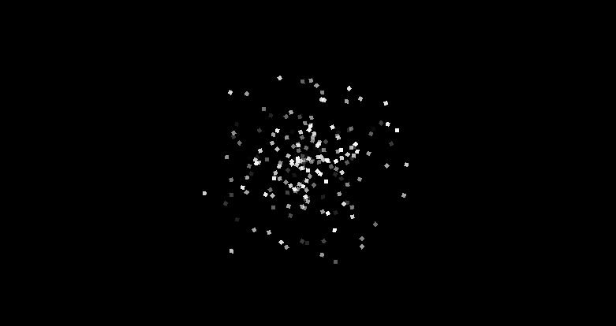

### Line Profile

The `LineProfile` distributes particles along a line segment with configurable direction control. Particles spawn at random positions along the line and can move in various patterns depending on the radiation mode.

```cs
// Basic version with random directions
Profile.Line(Vector2 axis, float length)

// Advanced version with direction control
Profile.Line(Vector2 axis, float length, LineRadiation radiate, Vector2 direction)
```

| Parameter   | Description                                                                                                                                                                                       |
| ----------- | ------------------------------------------------------------------------------------------------------------------------------------------------------------------------------------------------- |
| `axis`      | The direction vector of the line (will be normalized internally)                                                                                                                                  |
| `length`    | The total length of the line segment                                                                                                                                                              |
| `radiate`   | Controls how particle headings relate to the line orientation                                                                                                                                     |
| `direction` | The emission direction vector for direction radiation modes.  This value is ignored if the radiation mode is `LineRadiate.None`, `LineRadiate.PerpendicularUp` or `LineRadiate.PerpendicularDown` |

| Line Radiation                    | Description                                     | Visual Effect                                                                   |
| --------------------------------- | ----------------------------------------------- | ------------------------------------------------------------------------------- |
| `LineRadiation.None`              | Random directions regardless of line angle      |                            |
| `LineRadiation.Directional`       | All particles move in the specified direction   |              |
| `LineRadiation.PerpendicularUp`   | Particles move perpendicular upward from line   |      |
| `LineRadiation.PerpendicularDown` | Particles move perpendicular downward from line | 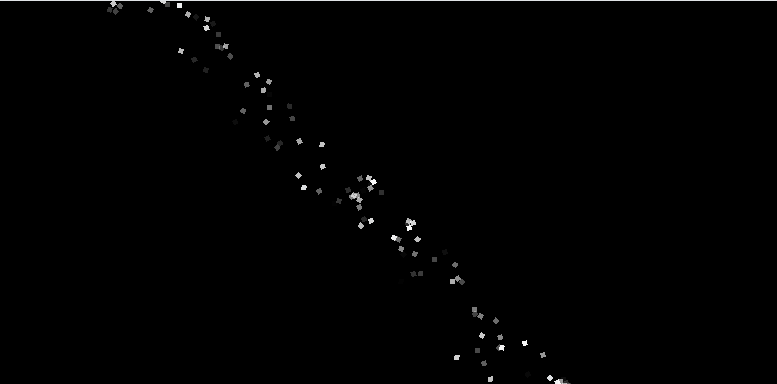 |

```cs title="LineProfile Code Example"
ParticleEmitter emitter = new ParticleEmitter(1500)
{
    Profile = Profile.Line(Vector2.UnitX, 800.0f, LineRadiation.Directional, Vector2.UnitY),
    LifeSpan = 10.0f,
    Parameters = new ParticleReleaseParameters
    {
        Quantity = new ParticleInt32Parameter(10, 15),
        Speed = new ParticleFloatParameter(25.0f, 75.0f)
    }
};
```


### Circle Profile

The `CircleProfile` distributes particles within a circular area with radiation patterns that control movement direction relative to the circle center.

```cs
Profile.Circle(float radius, CircleRadiation radiate)
```

| Parameter | Description                                              |
| --------- | -------------------------------------------------------- |
| `radius`  | The radius of the circular distribution area             |
| `radiate` | Controls how particle headings relate to their positions |

| Circle Radiation       | Description                                           | Visual Effect                                                           |
| ---------------------- | ----------------------------------------------------- | ----------------------------------------------------------------------- |
| `CircleRadiation.None` | Random movement directions for chaotic dispersal      | 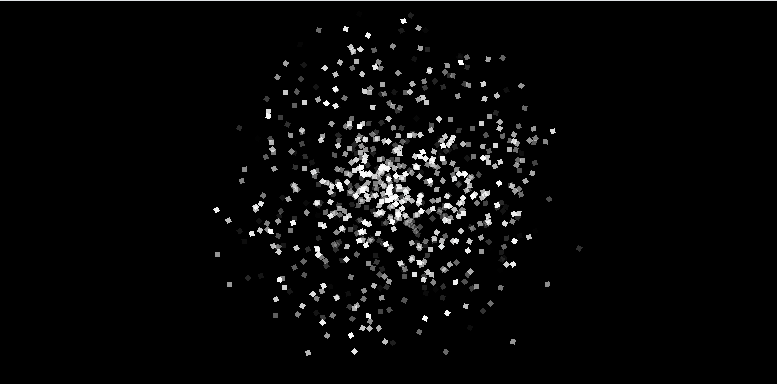 |
| `CircleRadiation.In`   | Particles move toward center for implosion effects    | 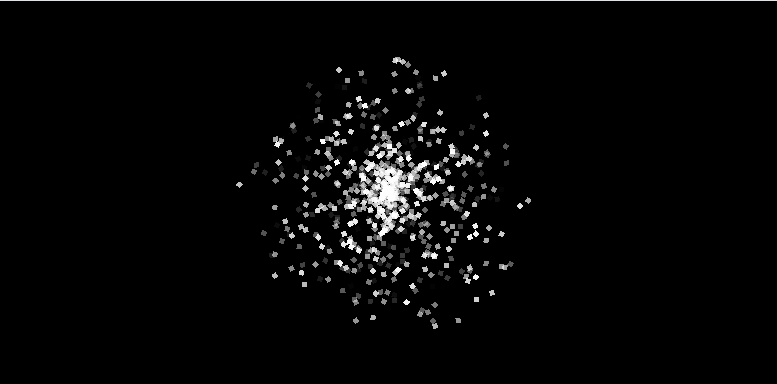     |
| `CircleRadiation.Out`  | Particles move away from center for explosion effects | 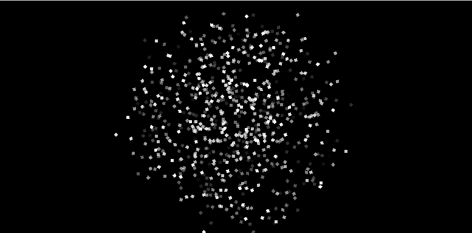   |

```cs title="CircleProfile Code Example"
ParticleEmitter emitter = new ParticleEmitter(1500)
{
    Profile = Profile.Circle(100.0f, CircleRadiation.Out),
    Parameters = new ParticleReleaseParameters
    {
        Quantity = new ParticleInt32Parameter(20, 30),
        Speed = new ParticleFloatParameter(75.0f, 200.0f)
    }
};
```

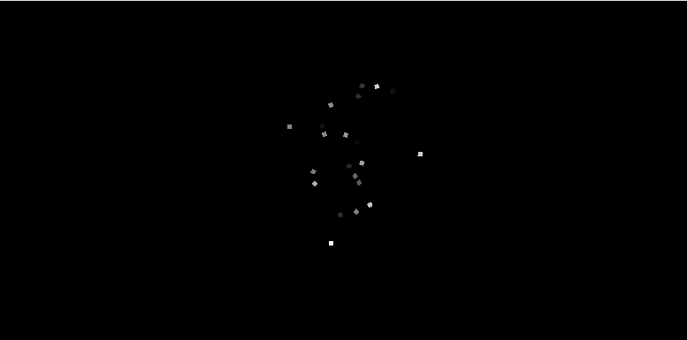

### Ring Profile

The `RingProfile` works like Circle Profile but constrains particles to the circle's perimeter only, creating hollow effects ideal for shockwaves and energy rings.

```cs
Profile.Ring(float radius, CircleRadiation radiate)
```

| Parameter | Description                                              |
| --------- | -------------------------------------------------------- |
| `radius`  | The radius of the ring                                   |
| `radiate` | Controls how particle headings relate to their positions |

:::note
Uses the same radiation patterns as Circle Profile but with particles starting only on the circumference rather than within the entire circular area.
:::

| Circle Radiation       | Description                                           | Visual Effect                                                       |
| ---------------------- | ----------------------------------------------------- | ------------------------------------------------------------------- |
| `CircleRadiation.None` | Random movement directions for chaotic dispersal      | 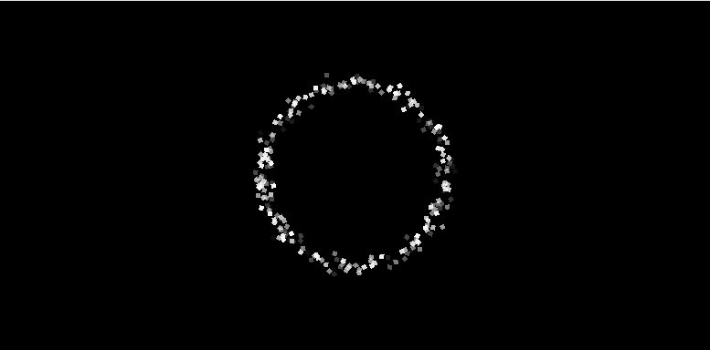 |
| `CircleRadiation.In`   | Particles move toward center for implosion effects    | 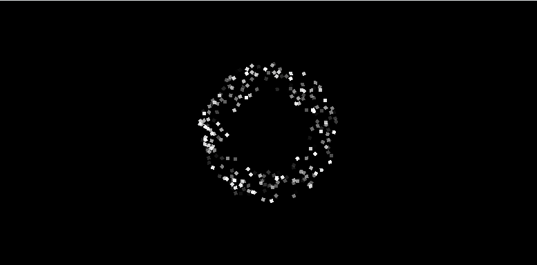     |
| `CircleRadiation.Out`  | Particles move away from center for explosion effects | 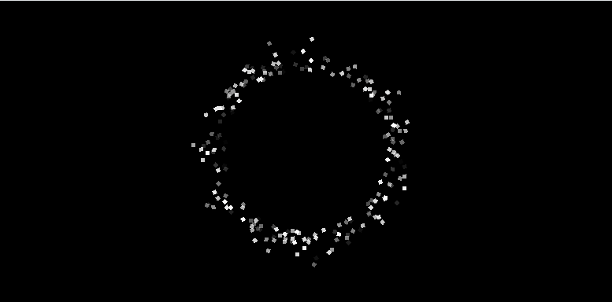   |

```cs title="RingProfile Code Example"
ParticleEmitter emitter = new ParticleEmitter(800)
{
    Profile = Profile.Ring(80.0f, CircleRadiation.Out),
    Parameters = new ParticleReleaseParameters
    {
        Quantity = new ParticleInt32Parameter(25, 35),
        Speed = new ParticleFloatParameter(150.0f, 250.0f)
    }
};
```

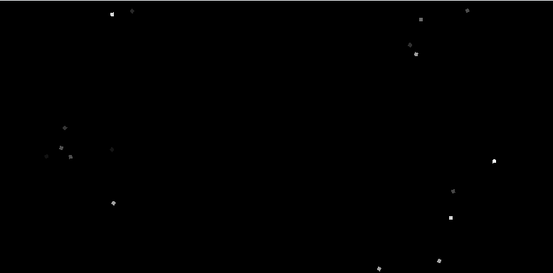

### Box Profile

The `BoxProfile` distributes particles along the edges of a rectangle, giving each edge equal probability regardless of length. This means each of the four edges receives 25% of the particles.

```cs
Profile.Box(float width, float height)
```

| Parameter | Description                             |
| --------- | --------------------------------------- |
| `width`   | The width of the rectangular perimeter  |
| `height`  | The height of the rectangular perimeter |

:::warning
For non-square rectangular perimeters, this profile creates uneven particle density since shorter edges receive the same number of particles as longer ones.
:::

```cs title="BoxProfile Code Example"
ParticleEmitter emitter = new ParticleEmitter(1200)
{
    Profile = Profile.Box(300.0f, 200.0f),
    Parameters = new ParticleReleaseParameters
    {
        Quantity = new ParticleInt32Parameter(8, 12),
        Speed = new ParticleFloatParameter(10.0f, 20.0f)
    }
};
```

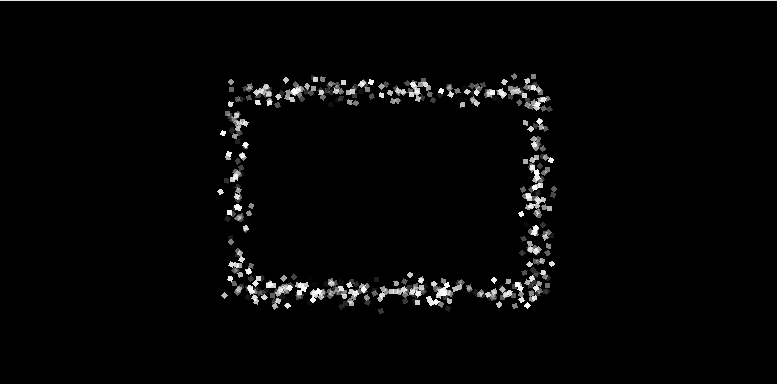

### BoxUniform Profile

The `BoxUniformProfile` improves upon `BoxProfile` by distributing particles proportionally to edge length, creating uniform particle density around the entire perimeter.

```cs
Profile.BoxUniform(float width, float height)
```

| Parameter | Description                             |
| --------- | --------------------------------------- |
| `width`   | The width of the rectangular perimeter  |
| `height`  | The height of the rectangular perimeter |

:::tip
Use this instead of `BoxProfile` when you need even distribution on rectangular shapes, as it allocates particles based on the relative length of each edge.
:::

```cs title="BoxUniformProfile Code Example"
ParticleEmitter emitter = new ParticleEmitter(1200)
{
    Profile = Profile.BoxUniform(300.0f, 200.0f),
    Parameters = new ParticleReleaseParameters
    {
        Quantity = new ParticleInt32Parameter(8, 12),
        Speed = new ParticleFloatParameter(10.0f, 20.0f)
    }
};
```

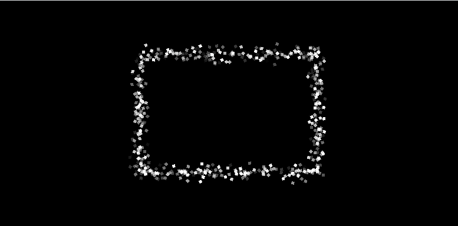

### BoxFill Profile

The `BoxFillProfile` fills the entire rectangular area with particles rather than just the perimeter, perfect for area effects like smoke clouds, magical fields, or environmental atmospheric effects.

```cs
Profile.BoxFill(float width, float height)
```

| Parameter | Description                             |
| --------- | --------------------------------------- |
| `width`   | The width of the rectangular perimeter  |
| `height`  | The height of the rectangular perimeter |

Particles are randomly distributed throughout the rectangular area with random heading directions.

```cs title="BoxFillProfile Code Example"
ParticleEmitter emitter = new ParticleEmitter(2000)
{
    Profile = Profile.BoxFill(200.0f, 150.0f),
    Parameters = new ParticleReleaseParameters
    {
        Quantity = new ParticleInt32Parameter(25, 35),
        Speed = new ParticleFloatParameter(5.0f, 25.0f)
    }
};
```

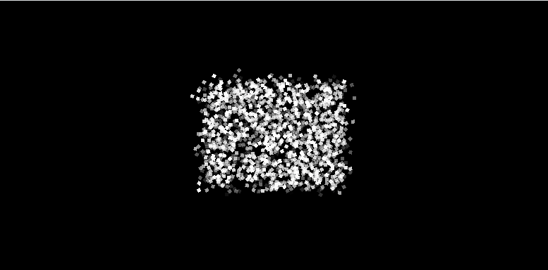

### Spray Profile

The `SprayProfile` emits particles from a single point in a directional cone, perfect for focused effects like flamethrowers, water hoses, or weapon fire.

```cs
Profile.Spray(Vector2 direction, float spread)
```

| Parameter   | Description                                    |
| ----------- | ---------------------------------------------- |
| `direction` | The central direction vector of the spray cone |
| `spread`    | The angular width of the spray cone in radians |

| Spread Angle      | Description                                        | Visual Effect                                               |
| ----------------- | -------------------------------------------------- | ----------------------------------------------------------- |
| 0 radians         | Perfectly focused beam                             |      |
| π/4 (45°)         | Narrow cone for flamethrowers                      | 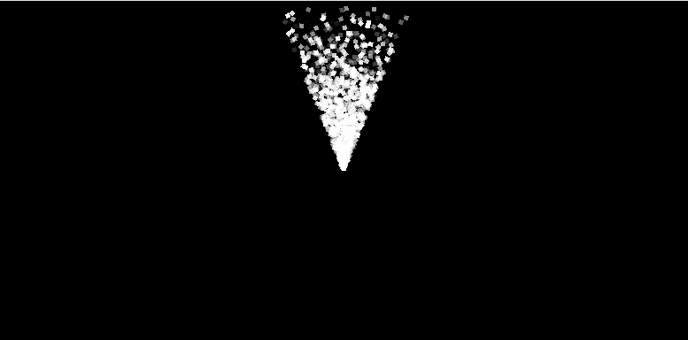   |
| π/2 (90°)         | Medium spread for general effects                  | 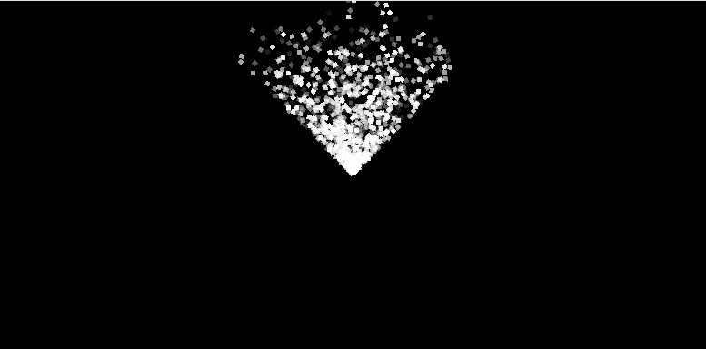   |
| π (180°)          | Wide semicircle fan                                |  |
| 2π radians (360°) | Full circle, equivalent to `PointProfile` behavior |  |

```cs title="SprayProfile Code Example"
ParticleEmitter emitter = new ParticleEmitter(2000)
{
    Profile = Profile.Spray(-Vector2.UnitY, MathF.PI / 6), 
    Parameters = new ParticleReleaseParameters
    {
        Quantity = new ParticleInt32Parameter(15, 25),
        Speed = new ParticleFloatParameter(100.0f, 200.0f)
    }
};
```

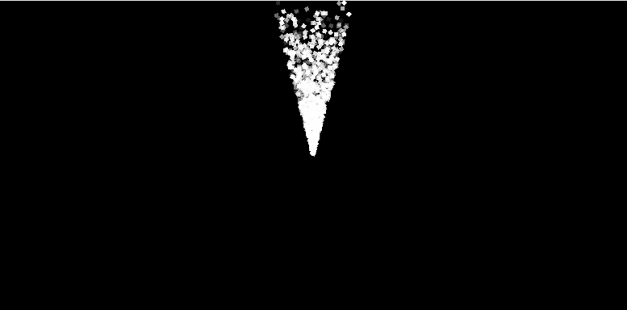

## Performance Considerations

Different profiles have varying computational complexity:

- **Lowest Overhead**: `PointProfile`, `BoxFillProfile` - Simple random generation only
- **Medium Overhead**: `LineProfile`, `BoxProfile`, `BoxUniformProfile` - Basic arithmetic operations
- **Higher Overhead**: `CircleProfile`, `RingProfile`, `SprayProfile` - Trigonometric calculations

All profiles are suitable for real-time applications, but consider using simpler profiles for effects requiring thousands of particles.

## Choosing the Right Profile

Select profiles based on the visual effect you want to achieve:

- **Explosions/Bursts**: `PointProfile`, `CircleProfile` (Out), `RingProfile` (Out)
- **Environmental Effects**: `LineProfile`, `BoxFillProfile` for area coverage
- **Directional Effects**: `SprayProfile`, `LineProfile` (Directional)
- **Implosions/Suction**: `CircleProfile` (In), `RingProfile` (In)
- **Barriers/Fields**: `LineProfile`, `BoxProfile`, `BoxUniformProfile`

## Conclusion

Emission profiles form the foundation of particle effect design by controlling initial particle placement and movement. Each profile serves specific visual purposes while offering different performance characteristics. Understanding these profiles enables you to create appropriate particle behaviors for your specific game effects
