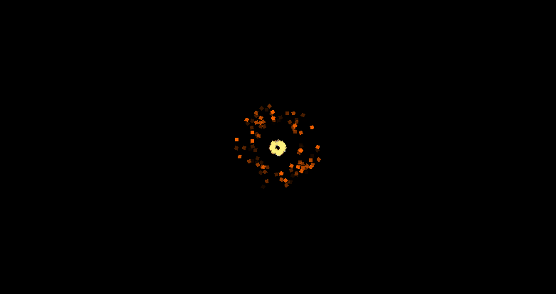
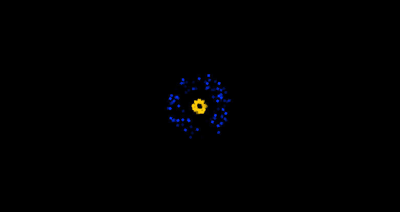
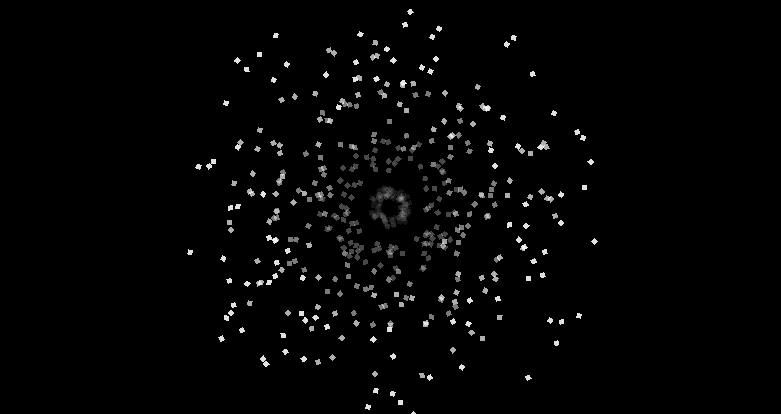
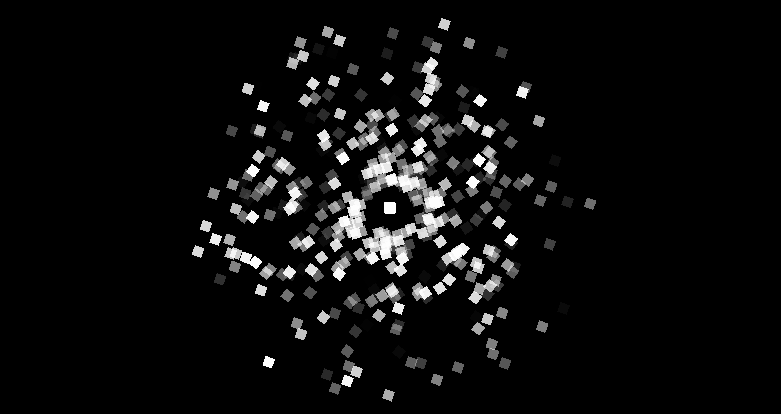
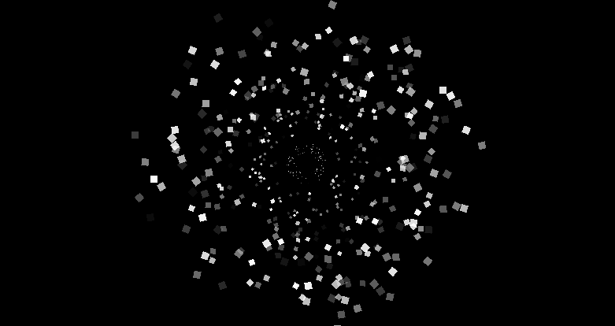
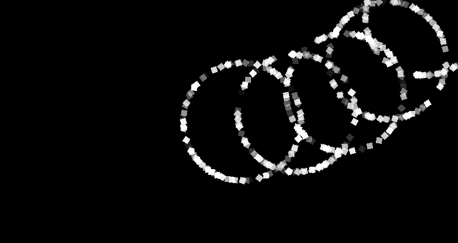
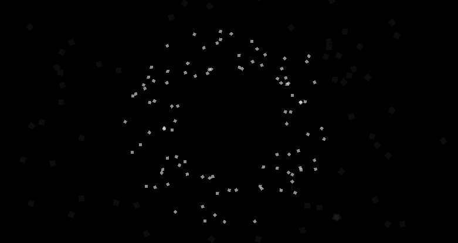

:::tip[Up to date]
This page is **up to date** for MonoGame.Extended `@mgeversion@`.  If you find outdated information, [please open an issue](https://github.com/monogame-extended/monogame-extended.github.io/issues).
:::

Interpolators are specialized components that create smooth property transitions in particle effects.  While [modifiers](./modifiers.md) control when and how particles change, interpolators define the specific transformations that occur, whether it is a particle fading from opaque to transparent, growing from small to large, or shifting from one color to another.

MonoGame Extended provides six interpolators, each designed to smoothly transition specific particle properties over time.  Understanding how to use and combine these interpolators enables you to create effects with smooth animations.

In this guide, you will learn how to use each interpolator effectively and understand their impact on particle appearance.

By the end fo this guide, you will understand:

- How interpolators create smooth property transitions
- The specific particle properties each interpolator controls
- How to configure interpolators for different visual effects
- How interpolators work with Age and Velocity modifiers

## Interpolator System Architecture

All interpolators inherit from a common base class that defines the interpolation mechanism:

```cs title="Interpolator and Interpolator<T>"
public abstract class Interpolator
{
    public string Name { get; set; }
    public bool Enabled { get; set; } = true;
    
    public abstract unsafe void Update(float amount, Particle* particle);
}

public abstract class Interpolator<T> : Interpolator where T : struct
{
    public T StartValue { get; set; }
    public T EndValue { get; set; }
}
```

| Property     | Description                              |
| ------------ | ---------------------------------------- |
| `Name`       | The display name of the interpolator     |
| `Enabled`    | Whether the interpolator is enabled      |
| `StartValue` | The starting value for the interpolation |
| `EndValue`   | The end value for the interpolation      |

Interpolators work by calculating intermediate values between the `StartValue` and `EndValue` properties based on an interpolation amount (typically between `0.0f` and `1.0f`).  This amount represents the progress through the interpolation: `0.0f` applies the `StartValue`, `1.0f` applies the `EndValue` and `0.5f` applies a value halfway between.

### How Interpolators Work With Modifiers

Interpolators do not operate independently.  They are used by modifiers to determine what changes to apply:

- [`AgeModifier`](./modifiers.md#age-modifier): Uses particles age as a percentage of lifespan (`0.0f` = just born, `1.0f` = about to expire)
- [`VelocityModifier`](./modifiers.md#velocity-modifier): uses particle speed relative to a threshold (`0.0f` = stationary, `1.0f` = at or above threshold speed)

This relationship allows for both time-based and speed-based property changes

## Available Interpolators

### Color Interpolator

The `ColorInterpolator` transitions between HSL colors, affecting hue, saturation, and lightness values simultaneously

| Property     | Description                                                                        |
| ------------ | ---------------------------------------------------------------------------------- |
| `StartValue` | Initial HSL color (`Vector3`: Hue in degrees 0-360, Saturation 0-1, Lightness 0-1) |
| `EndValue`   | Final HSL color (`Vector3`: Hue in degrees 0-360, Saturation 0-1, Lightness 0-1)   |

```cs title="ColorInterpolator Example
emitter.Modifiers.Add(new AgeModifier()
{
    Interpolators =
    [
        new ColorInterpolator
        {
            StartValue = new Vector3(60.0f, 1.0f, 0.8f),  // Bright yellow
            EndValue = new Vector3(0.0f, 1.0f, 0.3f)      // Dark red
        }
    ]
});
```



### Hue Interpolator

The `HueInterpolator` changes only the hue component of particle colors while preserving saturationa nd lightness.

| Property     | Description                    |
| ------------ | ------------------------------ |
| `StartValue` | Initial hue in degrees (0-360) |
| `EndValue`   | Final hue in degrees (0-360)   |

```cs title="HueInterpolator Example
emitter.Modifiers.Add(new AgeModifier()
{
    Interpolators =
    [
        new HueInterpolator
        {
            // Start at red
            StartValue = 0.0f,

            // Cycle through all colors
            EndValue = 360.0f
        }
    ]
});
```



### Opacity Interpolator

The `OpacityInterpolator` controls particle transparency, creating fade-in or fade-out effects

| Property     | Description                                             |
| ------------ | ------------------------------------------------------- |
| `StartValue` | Initial opacity (`0.0f` = transparent, `1.0f` = opaque) |
| `EndValue`   | Final opacity (`0.0f` = transparent, `1.0f` = opaque)   |

```cs title="OpacityInterpolator Example
emitter.Modifiers.Add(new AgeModifier()
{
    Interpolators =
    [
        new OpacityInterpolator
        {
            // Start invisible
            StartValue = 0.0f,

            // Fade in to full opacity
            EndValue = 1.0f
        }
    ]
});
```



### Rotation Interpolator

The `RotationInterpolator` changes particle rotation angle over time, creating spinning or orientation effects.

| Property     | Description                       |
| ------------ | --------------------------------- |
| `StartValue` | Initial rotation angle in radians |
| `EndValue`   | Final rotation angle in radians   |

```cs title="RotationInterpolator Example
emitter.Modifiers.Add(new AgeModifier()
{
    Interpolators =
    [
        new RotationInterpolator
        {
            // Start invisible
            StartValue = 0.0f,

            // Full rotation (360 degrees)
            EndValue = MathF.PI * 2.0f
        }
    ]
});
```



### Scale Interpolator

The `ScaleInterpolator` changes particle size over time, using `Vector2` values to control width and height scaling independently.

| Property     | Description                                              |
| ------------ | -------------------------------------------------------- |
| `StartValue` | Initial scale multiplier (`Vector2` for X and Y scaling) |
| `EndValue`   | Final scale multiplier (`Vector2` for X and Y scaling)   |

```cs title="ScaleInterpolator Example
emitter.Modifiers.Add(new AgeModifier()
{
    Interpolators =
    [
        new ScaleInterpolator
        {
            // Start with no size
            StartValue = Vector2.Zero,

            // Grow to double size
            EndValue = new Vector2(2.0f, 2.0f)
        }
    ]
});
```



### Velocity Interpolator

The `VelocityInterpolator` modifies particle velocity over time, enabling acceleration, deceleration, or direction changes.

| Property     | Description                                                |
| ------------ | ---------------------------------------------------------- |
| `StartValue` | Initial velocity vector (`Vector2` for X and Y components) |
| `EndValue`   | Final velocity vector (`Vector2` for X and Y components)   |

```cs title="VelocityInterpolator Example
emitter.Modifiers.Add(new AgeModifier()
{
    Interpolators =
    [
        new VelocityInterpolator
        {
            // Start with no size
            StartValue = new Vector2(100.0f, 0.0f),

            // Grow to double size
            EndValue =  new Vector2(50.0f, -100.0f)
        }
    ]
});
```



## Combining Interpolators

Multiple interpolators can be used together to create complex, layered effects.  each interpolator operates independently on its specific particle property.

### Classic Fade-Out with Growth Effect

```cs title="Fade-Out with Growth Effect"
emitter.Modifiers.Add(new AgeModifier
{
    Interpolators =
    {
        new OpacityInterpolator
        {
            // Start opaque
            StartValue = 1.0f,

            // Fade to transparent
            EndValue = 0.0f
        },
        new ScaleInterpolator
        {
            // Start small
            StartValue = new Vector2(1.0f, 1.0f),

            // Grow large
            EndValue = new Vector2(10.0f, 10.0f)
        }
    }
});
```



### Fire Effect with Color, Opacity, and Scale Changes

```cs title="Fire Effect with Color, Opacity, and Scale Changes"
emitter.Modifiers.Add(new AgeModifier
{
    Interpolators =
    {
        new ColorInterpolator
        {
            // Bright Yellow
            StartValue = new Vector3(60.0f, 1.0f, 0.8f),

            // Dark red
            EndValue = new Vector3(0.0f, 0.8f, 0.2f)
        },
        new OpacityInterpolator
        {
            // Fully opaque
            StartValue = 1.0f,

            // Fully transparent
            EndValue = 0.0f
        },
        new ScaleInterpolator
        {
            // Start small
            StartValue = new Vector2(0.8f, 0.8f),

            // Grow large
            EndValue = new Vector2(10f, 10f)
        }
    }
});
```


## Performance Considerations

Interpolators are generally lightweight components with minimal performance impact:

- **Calculation Costs**: All interpolators perform simple linear interpolation calculations
- **Memory Usage**: Each interpolator stores only start and end values with minimal to no state
- **Update Frequency**: Interpolators run only when their associated modifiers execute.

The number of interpolators per modifier has little impact on performance.

## Conclusion

Interpolators are the components that create smooth transition for particle effects.  The key to effective interpolator use is experimentation and iteration.  Start with simple single-interpolator effects, then gradually layer additional interpolators to achieve the exact visual behavior you need.

Remember that interpolators work best when their transitions feel natural and support the overall effect you are trying to achieve.
