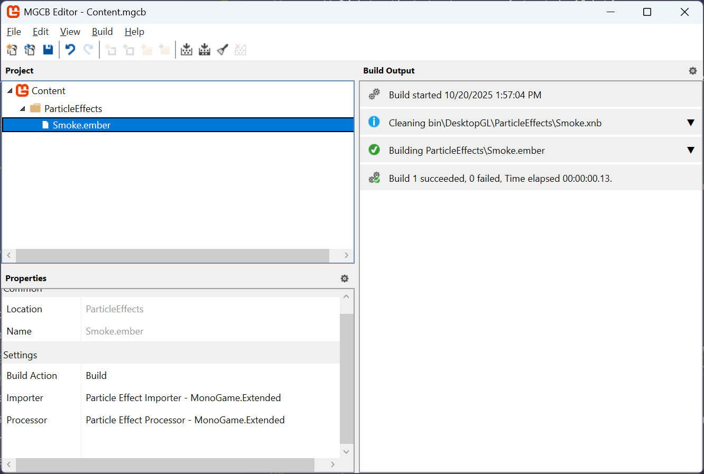

:::tip[Up to date]
This page is **up to date** for MonoGame.Extended `@mgeversion@`.  If you find outdated information, [please open an issue](https://github.com/monogame-extended/monogame-extended.github.io/issues).
:::

Ember files (`.ember`) are XML-based particle effect files created by the [Ember Editor](../../tools/ember.md), a visual particle effect editor for MonoGame Extended. These files contain complete particle effect configurations including emitter settings, modifiers, interpolators, and texture references.

This guide explains how to load and use `.ember` files in your MonoGame projects, covering both the Content Pipeline approach and direct file loading.

## Understanding Ember Files

An `.ember` file contains:

- **Particle Effect Properties**: Position, rotation, scale, auto-trigger settings
- **Emitter Configurations**: One or more emitters with their profiles, parameters, and settings
- **Modifiers and Interpolators**: Behavior definitions for particle animation
- **Texture References**: Paths to texture files used by emitters

When you load an `.ember` file, MonoGame Extended deserializes this XML data into a `ParticleEffect` object that you can use in your game exactly like particle effects created in code.

## Loading Methods

There are two ways to load `.ember` files in your MonoGame project:

1. **Content Pipeline Method** (Recommended): Pre-processes files at build time with automatic dependency tracking
2. **Direct File Loading**: Loads files at runtime for rapid iteration and prototyping

## Method 1: Content Pipeline (Recommended)

The Content Pipeline method provides the most robust integration with your game's content management system.

### Prerequisites

Before using the Content Pipeline method, you need:

1. **MonoGame Extended Content Pipeline Extension**: The pipeline extension DLL that processes `.ember` files
2. **Content Pipeline Reference**: The extension must be referenced in your Content.mgcb file

See the [Setting Up MGCB Editor documentation](../../getting-started/installation-monogame.mdx#optional-setup-mgcb-editor) for detailed information setting this up.

### Step 1: Add the Ember File to Your Content Project

1. Open your `Content.mgcb` file in the MGCB Editor
2. Add your `.ember` file to the content project:
   - Click **Edit > Add > Existing Item**
   - Navigate to your `.ember` file
   - Select the file and click **Open**

The MGCB Editor will automatically:

- Detect the `.ember` file extension
- Assign the "Particle Effect Importer - MonoGame.Extended" importer
- Assign the "Particle Effect Processor - MonoGame.Extended" processor



### Step 2: Ensure Texture Files Are Available

Place any texture files referenced by your particle effect in the **same directory as the `.ember`** file or ensure they're already in your content project.

The Content Pipeline will automatically:

- Track texture dependencies
- Validate that textures exist at build time
- Rebuild the `.ember` file if any texture changes

:::warning
The texture files must be in the same directory at the `.ember` file.  They do not have to be added to the content project.  However, if you wish to add them to the content project, ensure that they are in the same directory in the content project as the `.ember` file.  If a referenced texture is missing, you will get a build error. This is intentional to catch missing assets before runtime.
:::

### Step 3: Load the Particle Effect in Your Game

Load the particle effect using the standard `ContentManager.Load<T>` method:

```cs
public class Game1 : Game
{
    private ParticleEffect _particleEffect;

    protected override void LoadContent()
    {
        // Load the particle effect (no file extension needed)
        _particleEffect = Content.Load<ParticleEffect>("ParticleEffects/Smoke");
        
        // Position the effect
        _particleEffect.Position = new Vector2(400, 300);
        
        base.LoadContent();
    }

    protected override void Update(GameTime gameTime)
    {
        _particleEffect.Update(gameTime);
        base.Update(gameTime);
    }

    protected override void Draw(GameTime gameTime)
    {
        GraphicsDevice.Clear(Color.Black);
        
        _spriteBatch.Begin();
        _spriteBatch.Draw(_particleEffect);
        _spriteBatch.End();
        
        base.Draw(gameTime);
    }
}
```

### Content Pipeline Benefits

Using the Content Pipeline provides several advantages:

**Build-Time Validation**

```
Build Error: Cannot find texture 'particle_texture.png' 
referenced by 'FireEffect.ember'
```

Errors are caught during build, not at runtime.

**Automatic Dependency Tracking**

- Modifying a texture automatically triggers a rebuild of dependent `.ember` files
- No need to manually track which effects use which textures

**Optimized Loading**

- Textures are loaded through the Content Pipeline's texture processor
- Benefits from texture compression and platform-specific optimizations

## Method 2: Direct File Loading

Direct file loading is useful for rapid iteration during development or when you need to load effects dynamically at runtime.

### Step 1: Prepare Your Files

Organize your files so that textures are either:

- In the same directory as the `.ember` file, or
- Already loaded through the Content Pipeline

### Step 2: Load Using ParticleEffectSerializer

Use the `ParticleEffectSerializer` class to load the effect directly:

```cs
public class Game1 : Game
{
    private ParticleEffect _particleEffect;

    protected override void LoadContent()
    {
        // Load the particle effect directly from file
        string effectPath = "Content/ParticleEffects/Smoke.ember";

        _particleEffect = ParticleEffectSerializer.Deserialize(effectPath, Content);
        
        // Position the effect
        _particleEffect.Position = new Vector2(400, 300);
        
        base.LoadContent();
    }

    protected override void Update(GameTime gameTime)
    {
        _particleEffect.Update(gameTime);
        base.Update(gameTime);
    }

    protected override void Draw(GameTime gameTime)
    {
        GraphicsDevice.Clear(Color.Black);
        
        _spriteBatch.Begin();
        _spriteBatch.Draw(_particleEffect);
        _spriteBatch.End();
        
        base.Draw(gameTime);
    }
}
```

### Loading from a Stream

You can also load from a stream for more advanced scenarios:

```cs
// Load using MonoGame's TitleContainer
using Stream stream = TitleContainer.OpenStream("Content/ParticleEffects/Smoke.ember");
ParticleEffect effect = ParticleEffectSerializer.Deserialize(stream, Content);
```

### Direct Loading Considerations

When using direct file loading, consider the following:

- The reader tries to load textures through the `ContentManager` first
- Falls back to loading texture files directly using `Texture2D.FromFile()`
- Texture paths in the `.ember` file are relative to the `.ember` file's location

## Working with Loaded Effects

Once loaded (via either method), particle effects work identically to effects created in code.

### Basic Usage

```cs
// Update the effect every frame
protected override void Update(GameTime gameTime)
{
    _particleEffect.Update(gameTime);
}

// Draw the effect
protected override void Draw(GameTime gameTime)
{
    _spriteBatch.Begin();
    _spriteBatch.Draw(_particleEffect);
    _spriteBatch.End();
}
```

### Positioning and Transforming

```cs
// Move the effect
_particleEffect.Position = playerPosition;

// Rotate the effect (in radians)
_particleEffect.Rotation = MathHelper.ToRadians(45);

// Scale the effect
_particleEffect.Scale = new Vector2(2.0f, 2.0f);
```

### Manual Triggering

If the effect has `AutoTrigger` set to `false`:

```cs
// Trigger all emitters at the effect's current position
_particleEffect.Trigger();

// Trigger at a specific position
_particleEffect.Trigger(explosionPosition);

// Trigger along a line
LineSegment line = new LineSegment(startPos, endPos);
_particleEffect.Trigger(line, layerDepth: 0.5f);
```

### Accessing Emitters

You can access and modify individual emitters after loading:

```cs
// Access emitters by index
ParticleEmitter firstEmitter = _particleEffect.Emitters[0];

// Find emitters by name
ParticleEmitter fireEmitter = _particleEffect.Emitters
    .FirstOrDefault(e => e.Name == "Fire Emitter");

// Modify emitter properties at runtime
if (fireEmitter != null)
{
    fireEmitter.Parameters.Speed = new ParticleFloatParameter(50.0f, 100.0f);
}
```

## Texture Dependencies

Understanding how texture dependencies work is important for both loading methods.

### How Textures Are Stored in Ember Files

Ember files store texture references in the `TextureRegion` element:

```xml
<TextureRegion Name="particle_texture.png" Bounds="0 0 32 32" />
```

The `Name` attribute contains the texture filename, which can be:

- Just a filename: `particle_texture.png`
- A relative path: `../Textures/particle_texture.png`
- An asset name (when using Content Pipeline): `Textures/ParticleTexture`

### Texture Loading Behavior

**Content Pipeline Method:**

- Textures must exist at build time
- Texture paths are resolved relative to the `.ember` file location
- Missing textures cause build failures

**Direct Loading Method:**

1. First attempts to load via `ContentManager.Load<Texture2D>(name)`
2. If that fails, attempts to load directly from file using texture path relative to `.ember` file
3. If both fail, the emitter will have no texture (particles won't render)

## Troubleshooting

### Build Error: Cannot Find Texture

**Problem:** Content Pipeline build fails with texture not found error.

**Solution:**

- Ensure texture files are in the same directory as the `.ember` file
- Check that texture filenames in the `.ember` file match actual filenames (case-sensitive on some platforms)
- Verify texture files are included in your content project

### Runtime Error: Texture Loading Failed

**Problem:** Direct loading succeeds but particles don't render.

**Solution:**

- Check console output for texture loading warnings
- Verify texture paths are relative to the `.ember` file location
- Ensure textures are either in the correct relative path or loaded through Content Pipeline

### Particles Not Appearing

**Problem:** Effect loads but no particles appear.

**Solution:**

- Verify the effect is being updated: `_particleEffect.Update(gameTime)`
- Check if `AutoTrigger` is `false` - you may need to call `Trigger()` manually
- Ensure effect position is within viewport bounds
- Verify emitter has a valid texture assigned
- Check emitter capacity isn't exhausted

## Additional Resources

For more information about creating particle effects:

- [Ember Editor Manual](../../tools/ember.md)
- [MonoGame Extended Particle System: Quick Start Guide](./quick_start_guide.md)
- [MonoGame Extended Particle System: Emission Profiles Guide](./emission_profiles.md)
- [MonoGame Extended Particle System: Modifiers Guide](./modifiers.md)
- [MonoGame Extended Particle System: Interpolators Guide](./interpolators.md)
