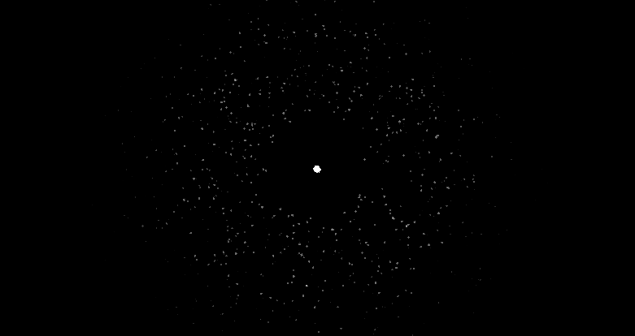
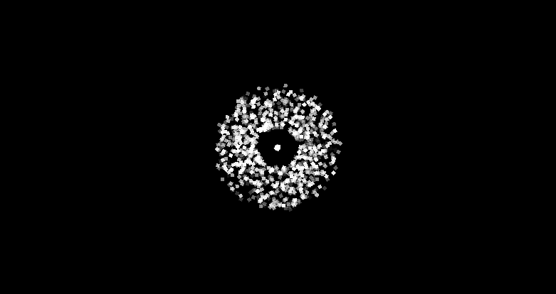
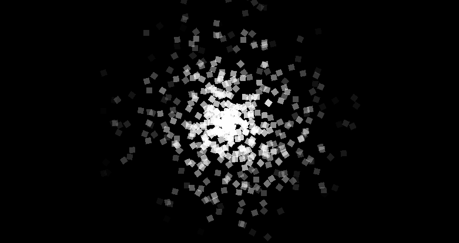
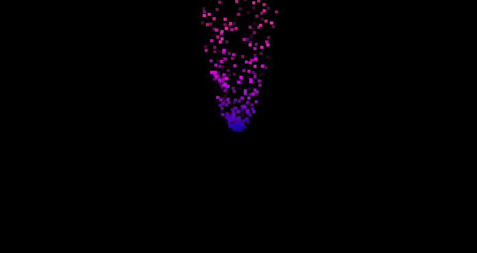
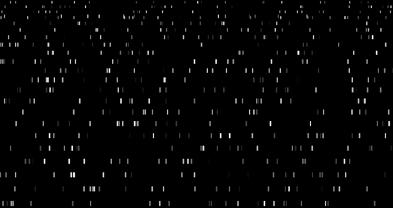
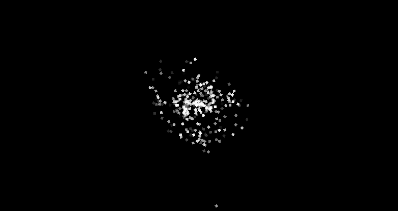

:::tip[Up to date]
This page is **up to date** for MonoGame.Extended `@mgeversion@`.  If you find outdated information, [please open an issue](https://github.com/monogame-extended/monogame-extended.github.io/issues).
:::

While [emission profiles](./emission_profiles.md) determine where particles begin their journey, modifiers control how particles behave and change throughout their lifetime. Modifiers are the dynamic components that bring particle effects to life by applying forces, changing visual properties, and creating complex behaviors over time.

MonoGame Extended provides a comprehensive collection of modifiers that can simulate physics, create visual transformations, and enforce spatial constraints. Understanding how to use and combine these modifiers enables you to create sophisticated particle effects that respond realistically to forces and change appearance over time.

In this guide, you will learn how to use each modifier effectively and understand their impact on particle behavior.

By the end of this guide, you will understand:

- How modifiers change particle properties over time
- The different categories of modifiers and their purposes
- How to configure each modifier for specific effects
- How to combine modifiers to create complex behaviors

## Modifier System Architecture

All modifiers inherit from an abstract base class that defines a single update method:

```cs
public abstract class Modifier
{
    public abstract void Update(float elapsedSeconds, ParticleIterator iterator);
}
```

Each modifier also has common properties:

| Property    | Description                                                                                      |
| ----------- | ------------------------------------------------------------------------------------------------ |
| `Name`      | The display name of the modifier                                                                 |
| `Enabled`   | Whether this modifier is enabled                                                                 |
| `Frequency` | How often the modifier attempts to update all particles per second (60.0f = 60 times per second) |

Modifiers are executed every frame for each active particle. They can modify any particle property including position, velocity, color, scale, rotation, and opacity. The order in which modifiers are applied can affect the final result, as each modifier sees the changes made by previous modifiers.

## Modifiers

### Age Modifier

The `AgeModifier` applies interpolators to particles based on their lifetime progression, enabling smooth property transitions from particle birth to death.

| Property        | Description                                                       |
| --------------- | ----------------------------------------------------------------- |
| `Interpolators` | The collection of interpolators that will be applied to particles |

```cs title="AgeModifier Code Example
emitter.Modifiers.Add(new AgeModifier
{
    Interpolators =
    {
        new OpacityInterpolator
        {
            // Start fully opaque
            StartValue = 1.0f,

            // End full transparent
            EndValue = 0.0f
        },
        new ScaleInterpolator
        {
            // Start 5x scale size
            StartValue = new Vector2(5.0f, 5.0f),

            // End at .5x scale size
            EndValue = new Vector2(0.5f, 0.5f)
        }
    }
});
```



### Drag Modifier

The `DragModifier` simulates fluid resistance, slowing particles based on their velocity to create realistic physics interactions with air or water.

| Properties        | Description                                                                                                                                                                        |
| ----------------- | ---------------------------------------------------------------------------------------------------------------------------------------------------------------------------------- |
| `DragCoefficient` | The drag coefficient, representing the aerodynamic or hydrodynamic properties of particles.  Higher values create strong drag effects, causing particles to slow down more quickly |
| `Density`         | The density of the fluid medium affecting the strength of the drag force                                                                                                           |

:::tip
For reference to approximate real-world drag coefficients, see [https://en.wikipedia.org/wiki/Drag_coefficient](https://en.wikipedia.org/wiki/Drag_coefficient)

For reference to approximate real-world density values for various fluids, see [https://en.wikipedia.org/wiki/Density#Various_materials](https://en.wikipedia.org/wiki/Density#Various_materials)
:::

```cs title="DragModifier Code Example
emitter.Modifiers.Add(new DragModifier
{
    Density = 2.0f,
    DragCoefficient = 0.8f
});
```



### Linear Gravity Modifier

The `LinearGravityModifier` applies constant directional acceleration to particles, simulating gravity or wind effects.

```cs
emitter.Modifiers.Add(new LinearGravityModifier
{
    Direction = Vector2.UnitY,  // Downward
    Strength = 100.0f
});
```

| Property    | Description                                                          |
| ----------- | -------------------------------------------------------------------- |
| `Direction` | The direction vector of the gravitational force                      |
| `Strength`  | The strength of the gravitational force, in units per second squared |

```cs title="LinearGravityModifier Code Example
emitter.Modifiers.Add(new LinearGravityModifier
{
    Direction = -Vector2.UnitY,  // Upward (negative Y)
    Strength = 150.0f
});
```


### Opacity Fast Fade Modifier

The `OpacityFastFadeModifier` provides a simple, performance-optimized way to fade particles out linearly over their lifetime.

:::info
This modifier requires no configuration and simply fades particles from full opacity to transparent over their lifespan. Use this instead of an Age Modifier with Opacity Interpolator when you only need basic fade-out behavior.
:::

```cs title="OpacityFastFadeModifier Example"
emitter.Modifiers.Add(new OpacityFastFadeModifier());
```



### Rotation Modifier

The `RotationModifier` applies constant rotational velocity to particles, making them spin at a consistent rate.

| Property       | Description                                                 |
| -------------- | ----------------------------------------------------------- |
| `RotationRate` | The rate at which particles rotation, in radians per second |

```cs title="RotationModifier Example"
emitter.Modifiers.Add(new RotationModifier
{
    RotationRate = 10.0f
});
```


### Velocity Color Modifier

The `VelocityColorModifier` changes particle colors based on their movement speed, creating dynamic color effects that respond to particle velocity.

| Property            | Description                                                                      |
| ------------------- | -------------------------------------------------------------------------------- |
| `StationaryColor`   | The color for particles that are stationary or moving slow                       |
| `VelocityColor`     | The color for particles that have reached or exceeded the velocity threshold     |
| `VelocityThreshold` | The velocity magnitude at which particles fully transition to the velocity color |

```cs title="VelocityColorModifier Example"
emitter.Modifiers.Add(new VelocityColorModifier
{
    VelocityThreshold = 400.0f,
    StationaryColor = new Vector3(240.0f, 1.0f, 0.3f),
    VelocityColor = new Vector3(360.0f, 1.0f, 0.7f),
});
```



### Velocity Modifier

The `VelocityModifier` applies interpolators based on particle speed, allowing properties to change in response to how fast particles are moving.

| Property            | Description                                                                      |
| ------------------- | -------------------------------------------------------------------------------- |
| `Interpolators`     | The collection of interpolators that will be applied to particles                |
| `VelocityThreshold` | The velocity magnitude at which particles reach the maximum interpolation effect |

```cs title="VelocityModifier Code Example"
emitter.Modifiers.Add(new VelocityModifier
{
    VelocityThreshold = 200.0f,
    Interpolators =
    {
        new ScaleInterpolator
        {
            StartValue = new Vector2(1),

            // Stretch vertically when moving faster
            EndValue = new Vector2(2.5f, 10.0f)
        }
    }
});
```



### Vortex Modifier

The `VortexModifier` creates vortex effects by applying rotated gravitational forces to particles, generating a spiral motion around the central point.

| Property        | Description                                                                                                                                             |
| --------------- | ------------------------------------------------------------------------------------------------------------------------------------------------------- |
| `Position`      | The position of the vortex center relative to the particle emission point                                                                               |
| `Strength`      | The force strength, in units per second squared, applied to particles at the outer radius                                                               |
| `OuterRadius`   | The maximum distance from the vortex center where forces are applied                                                                                    |
| `InnerRadius`   | The minimum distance from the vortex center where forces are applied. Used to create dead zones around the vortex center where particles are unaffected |
| `MaxVelocity`   | The maximum velocity magnitude that particles can reach under vortex influences                                                                         |
| `RotationAngle` | The rotation angle, in radians, applied to gravitational force vectors                                                                                  |

:::tip
The `RotationAngle` determines the motion pattern created by the vortex.

- 0° = Pure gravitation attraction (particles pulled straight inward)
- Small Angles (5°-20°) = Inward spirals and temporary orbital motions
- Medium Angles (30°-60°) = Wide deflection arcs around the vortex
- Large Angles (90°+) = Particles deflect around the vortex perimeter without entering

Positive angle values create counterclockwise rotations, where as negative angle values create clockwise rotations.
:::

```cs title="VortexModifier Code Example
emitter.Modifiers.Add(new VortexModifier
{
    Position = new(0, 0),
    Strength = 200.0f,
    RotationAngle = MathHelper.ToRadians(10.0f),
    OuterRadius = 100.0f,
    InnerRadius = 10.0f,
    MaxVelocity = 200.0f
});
```



## Containers

Container modifiers are special modifiers that enforce spatial boundaries on particle movement, either by bouncing particles off walls or wrapping them around edges.

### Circle Container Modifier

The `CircleContainerModifier` constrains particles within or outside a circular boundary

| Property                 | Description                                                                                                                                                                                                                                                                                                                                                           |
| ------------------------ | --------------------------------------------------------------------------------------------------------------------------------------------------------------------------------------------------------------------------------------------------------------------------------------------------------------------------------------------------------------------- |
| `Radius`                 | The radius of the circular container                                                                                                                                                                                                                                                                                                                                  |
| `Inside`                 | Indicates whether particles should be contained inside the circle                                                                                                                                                                                                                                                                                                     |
| `RestitutionCoefficient` | The coefficient of restitution (bounciness) for particle collisions with the boundary. A value of `1.0` creates a perfectly elastic collision where particles maintain their energy.  A value less than `1.0` creates inelastic collisions where particles lose their energy.  Values greater than `1.0` create super-elastic collisions where particles gain energy. |

```cs title="CircleContainerModifier Code Example
emitter.Modifiers.Add(new CircleContainerModifier
{
    Radius = 150.0f,
    RestitutionCoefficient = 0.2f
});
```


### Rectangle Container Modifier

The `RectangleContainerModifier` constrains particles within a rectangular boundary.

| Property                 | Description                                                                                                                                                                                                                                                                                                                                                           |
| ------------------------ | --------------------------------------------------------------------------------------------------------------------------------------------------------------------------------------------------------------------------------------------------------------------------------------------------------------------------------------------------------------------- |
| `Width`                  | The width of the rectangular boundary                                                                                                                                                                                                                                                                                                                                 |
| `Height`                 | The height of the rectangular boundary                                                                                                                                                                                                                                                                                                                                |
| `RestitutionCoefficient` | The coefficient of restitution (bounciness) for particle collisions with the boundary. A value of `1.0` creates a perfectly elastic collision where particles maintain their energy.  A value less than `1.0` creates inelastic collisions where particles lose their energy.  Values greater than `1.0` create super-elastic collisions where particles gain energy. |

```cs title="RectangleContainerModifier Code Example
emitter.Modifiers.Add(new RectangleContainerModifier
{
    Width = 400,
    Height = 200,
    RestitutionCoefficient = 0.2f
});
```


### Rectangle Loop Container Modifier

The `RectangleLoopContainerModifier` wraps particles to the opposite side when they exit the rectangular boundary, creating  seamless looping effects.

| Property | Description                            |
| -------- | -------------------------------------- |
| `Width`  | The width of the rectangular boundary  |
| `Height` | The height of the rectangular boundary |

```cs title="RectangleLoopContainerModifier Code Example
emitter.Modifiers.Add(new RectangleLoopContainerModifier
{
    Width = 200,
    Height = 100,
    RestitutionCoefficient = 0.2f
});
```


## Combining Modifiers

Modifiers can be combined to create complex, layered effects.  The order that the modifiers are added is important since each modifier sees the results of the previous modifications.

```cs title="Fire Effect Example"
// 1. Upward force (hot air rises)
emitter.Modifiers.Add(new LinearGravityModifier
{
    Direction = -Vector2.UnitY,
    Strength = 120.0f
});

// 2. Air resistance
emitter.Modifiers.Add(new DragModifier
{
    Density = 0.3f,
    DragCoefficient = 0.2f
});

// 3. Visual transitions over lifetime
emitter.Modifiers.Add(new AgeModifier
{
    Interpolators =
    {
        new OpacityInterpolator { StartValue = 1.0f, EndValue = 0.0f },
        new ColorInterpolator 
        { 
            // Bright red
            StartValue = new Vector3(0.0f, 1.0f, 0.7f),

            // Dark orange
            EndValue = new Vector3(30.0f, 0.8f, 0.2f)
        }
    }
});
```


## Performance Considerations

Different modifiers have varying computational costs:

- **Lowest Overhead**: `OpacityFastFadeModifier` and `RotationModifier`
- **Low Overhead**: `LinearGravityModifier`, `AgeModifier`, and `VelocityModifier`
- **Medium Overhead**: `DragModifier`, `VelocityColorModifier`, container modifiers
- **Higher Overhead**: `VortexModifier`

For high-performance effects, prefer simpler modifiers and limit the number of active modifiers per emitter.

## Choosing the Right Modifiers

Select modifiers based on the behavior you want to achive:

- **Physics Effects** `LinearGravityModifier`, `DragModifier`, `VortexModifier`
- **Visual Transitions**: `AgeModifier`, `VelocityModifier`, `VelocityColorModifier`
- **Spatial Controls**: Container modifiers for boundaries and wrapping
- **Simple Animations**: `RotationModifier` and `OpacityFastFadeModifier`

## Conclusion

Modifiers ar the heart of the particle system, transforming static particles into living effects.  Understanding how each modifier works and how they can be combined helps you create interesting particle effects.

The key to effective particle design is experimenting with different modifier combinations and understanding how their execution order affects the final result.  Start with simple effects and gradually layer on additional modifiers to achieve the exact behavior you need.
