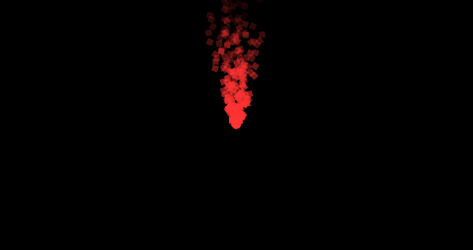
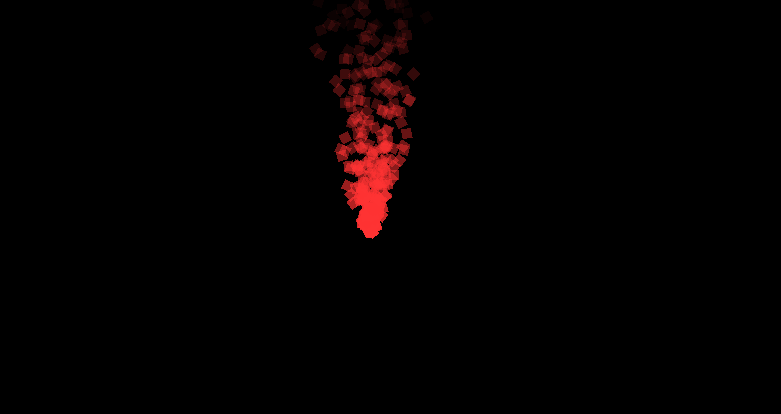
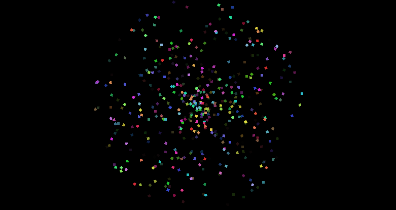

:::tip[Up to date]
This page is **up to date** for MonoGame.Extended `@mgeversion@`.  If you find outdated information, [please open an issue](https://github.com/monogame-extended/monogame-extended.github.io/issues).
:::

Visual effects bring games to life. Fire crackling, explosions bursting, stars sparkling, and magic spells shimmering all rely on particle systems to create these captivating moments. MonoGame Extended provides a particle system that makes creating these effects straightforward and flexible.

In this guide, you will learn how to create your first particle effects using code. We will start with a simple fire effect, show you how to make it interactive, and then explore two additional effects: explosions and sparkles.

By the end of this guide, you will understand:

- The core components of MonoGame Extended's particle system
- How to create and configure particle effects
- How to make effects respond to user input
- Techniques for creating different visual styles

## Setting Up Your Project

Before creating particle effects, you need to set up a MonoGame project with MonoGame Extended. This guide assumes you already have a working MonoGame project with the MonoGame Extended NuGet package installed.  If you don't have this setup, please refer to the [MonoGame Extended installation guide](../../getting-started/installation-monogame.mdx).

You will need these using statements at the top of your `Game1.cs` file:

```cs
using Microsoft.Xna.Framework;
using Microsoft.Xna.Framework.Graphics;
using Microsoft.Xna.Framework.Input;
using MonoGame.Extended.Graphics;
using MonoGame.Extended.Particles;
using MonoGame.Extended.Particles.Modifiers;
using MonoGame.Extended.Particles.Modifiers.Interpolators;
using MonoGame.Extended.Particles.Profiles;
```

Add these fields to your `Game1` class:

```csharp
public class Game1 : Game
{
    private GraphicsDeviceManager _graphics;
    private SpriteBatch _spriteBatch;
    
    // highlight-start
    private ParticleEffect _particleEffect;
    private Texture2D _particleTexture;
    // highlight-end
    
    // ... rest of your game class
}
```

For this guide, we will create a simple white pixel texture.  In a real game, you would probably want to use a more interesting texture, but this will work perfectly for learning.  In your `LoadContent` method, add the following to create a simple 1x1 white pixel texture:

```cs
protected override void LoadContent()
{
    _spriteBatch = new SpriteBatch(GraphicsDevice);

    //highlight-start
    // Create a simple 1x1 white texture for our particles
    _particleTexture = new Texture2D(GraphicsDevice, 1, 1);
    _particleTexture.SetData(new[] { Color.White });
    
    CreateParticleEffect();
    // highlight-end
}
```

## Creating Your First Effect: Fire

The particle system in MonoGame Extended is built around two core concepts:

- **ParticleEffect**: A container that holds one or more emitters and can be positioned, rotated, and scaled as a unit.
- **ParticleEmitter**: The component that creates and manages individual particles, defining how they look and behave.

Let's create a fire effect to see these concepts in action. Add this method to your `Game1` class:

```cs
private void CreateParticleEffect()
{
    Vector2 viewportCenter = GraphicsDevice.Viewport.Bounds.Center.ToVector2();

    // Create the main effect container
    _particleEffect = new ParticleEffect("Fire")
    {
        Position = viewportCenter,

        // Automatically trigger particle emitters
        AutoTrigger = true,

        // Emit particles every 0.1 seconds
        AutoTriggerFrequency = 0.1f
    };

    // Create the emitter that actually makes the particles.
    // With a capacity of 2000
    ParticleEmitter emitter = new ParticleEmitter(2000)
    {
        Name = "Fire Emitter",

        // Each particle created by this emitter lives for 2 seconds
        LifeSpan = 2.0f,
        TextureRegion = new Texture2DRegion(_particleTexture),

        // Use a spray profile - particles emit in a directional cone
        Profile = Profile.Spray(-Vector2.UnitY, 2.0f),

        // Set up how particles look when they're created
        Parameters = new ParticleReleaseParameters
        {
            // Release 10-20 particles each time
            Quantity = new ParticleInt32Parameter(10, 20),

            // Random speed between 10-40
            Speed = new ParticleFloatParameter(10.0f, 40.0f),

            // Red color  using HSL values (Hue=0°, Saturation = 100%, Lightness=60%)
            Color = new ParticleColorParameter(new Vector3(0.0f, 1.0f, 0.6f)),

            // Make them 10x bigger
            Scale = new ParticleVector2Parameter(new Vector2(10f, 10f))
        }
    };

    // Add fire-like behavior
    emitter.Modifiers.Add(new LinearGravityModifier
    {
        // Point upward (negative Y)
        Direction = -Vector2.UnitY,

        // Make fire rise with this much force
        Strength = 100f
    });

    // Make particles fade out as they age
    emitter.Modifiers.Add(new AgeModifier
    {
        Interpolators =
        {
            new OpacityInterpolator
            {
                // Start fully visible
                StartValue = 1.0f,

                // Fade to transparent over lifetime
                EndValue = 0.0f
            }
        }
    });

    // Add the emitter to our effect
    _particleEffect.Emitters.Add(emitter);
}
```

### Understanding the Fire Effect

Let's break down what makes this fire effect work:

- **Emission Profile**: The `Profile.Spray(-Vector2.UnitY, 2.0f)` creates a cone-shaped emission pattern pointing upward. The `-Vector2.UnitY` points up (negative Y direction), and `2.0f` controls the width of the cone.
- **Particle Parameters**: Each particle gets randomized properties within specified ranges. The `ParticleInt32Parameter(10, 20)` means between 10 and 20 particles are released each trigger.
- **HSL Color System**: Colors use HSL (Hue, Saturation, Lightness) values. Red fire uses Hue=0° (red), Saturation=1.0 (fully saturated), and Lightness=0.6 (medium brightness).
- **Modifiers**: These change particle behavior over time:
  - `LinearGravityModifier` makes particles rise like hot air
  - `AgeModifier` with `OpacityInterpolator` makes particles fade out as they age

Now update your `Update` and `Draw` methods to handle the particle effect:

```csharp
protected override void Update(GameTime gameTime)
{
    if (GamePad.GetState(PlayerIndex.One).Buttons.Back == ButtonState.Pressed || 
        Keyboard.GetState().IsKeyDown(Keys.Escape))
        Exit();

    // highlight-start
    // Update the particle effect
    _particleEffect.Update(gameTime);
    // highlight-end
}

protected override void Draw(GameTime gameTime)
{
    GraphicsDevice.Clear(Color.Black);

    // highlight-start
    _spriteBatch.Begin();

    // Draw the particle effect
    _spriteBatch.Draw(_particleEffect);

    _spriteBatch.End();
    // highlight-end
}
```

Run your game, and you should see a fire effect in the center of the screen with particles rising upward and fading out over time.



## Making Effects Interactive: Mouse Following

Static effects are nice, but interactive effects are more engaging. Let's modify the fire effect to follow your mouse cursor. Update your `Update` method:

```cs
protected override void Update(GameTime gameTime)
{
    if (GamePad.GetState(PlayerIndex.One).Buttons.Back == ButtonState.Pressed || 
        Keyboard.GetState().IsKeyDown(Keys.Escape))
        Exit();

    // Move the fire effect to follow the mouse
    MouseState mouseState = Mouse.GetState();
    _particleEffect.Position = new Vector2(mouseState.X, mouseState.Y);

    _particleEffect.Update(gameTime);

    base.Update(gameTime);
}
```

Now when you run the game, the fire effect will follow your mouse cursor around the screen. This simple change demonstrates how particle effects can respond to player input or game events.



:::tip
You can make effects follow any game object by updating the `Position` property. For example, in a platformer, you could make a magic aura follow the player character or create exhaust trails behind a spaceship.
:::

## Creating Different Effects

The same particle system components can create vastly different visual effects by adjusting parameters and modifiers. Let's create two more effects to explore this flexibility.

### Explosion Effect

Explosions require a different approach than continuous fire. They should trigger once, spread particles outward, and then settle under gravity. Replace the `CreateParticleEffect` method with this explosion version:

```cs
private void CreateParticleEffect()
{
    Vector2 viewportCenter = GraphicsDevice.Viewport.Bounds.Center.ToVector2();

    _particleEffect = new ParticleEffect("Explosion")
    {
        Position = viewportCenter,

        // Disable auto trigger - we'll trigger manually
        AutoTrigger = false,
    };

    ParticleEmitter emitter = new ParticleEmitter(2000)
    {
        Name = "Explosion Emitter",
        LifeSpan = 2.0f,
        TextureRegion = new Texture2DRegion(_particleTexture),

        // Change the profile to make particles explode outward
        Profile = Profile.Circle(20, CircleRadiation.Out),

        Parameters = new ParticleReleaseParameters
        {
            Quantity = new ParticleInt32Parameter(10, 20),

            // Increase random speed to 100-200
            Speed = new ParticleFloatParameter(100f, 200f),

            Color = new ParticleColorParameter(new Vector3(0.0f, 1.0f, 0.6f)),
            Scale = new ParticleVector2Parameter(new Vector2(10.0f, 10.0f))
        }
    };

    emitter.Modifiers.Add(new LinearGravityModifier
    {
        // Change gravity to move down
        Direction = Vector2.UnitY,

        // Strength increased to 200
        Strength = 200f
    });

    emitter.Modifiers.Add(new AgeModifier
    {
        Interpolators =
        {
            new OpacityInterpolator
            {
                StartValue = 1.0f,
                EndValue = 0.0f
            }
        }
    });

    // Add drag modifier for air resistance
    emitter.Modifiers.Add(new DragModifier
    {
        Density = 0.5f,
        DragCoefficient = 0.3f
    });

    _particleEffect.Emitters.Add(emitter);
}
```

For explosions, you will want to trigger them manually. Update your `Update` method to trigger an explosion when you click the mouse:

```cs
protected override void Update(GameTime gameTime)
{
    if (GamePad.GetState(PlayerIndex.One).Buttons.Back == ButtonState.Pressed || 
        Keyboard.GetState().IsKeyDown(Keys.Escape))
        Exit();

    MouseState mouseState = Mouse.GetState();
    _particleEffect.Position = new Vector2(mouseState.X, mouseState.Y);

    // Trigger explosion on mouse click
    if (mouseState.LeftButton == ButtonState.Pressed)
    {
        _particleEffect.Trigger();
    }

    _particleEffect.Update(gameTime);
}
```

Now if you run the game and click the mouse around the game window, each time you click, the explosion particle effect will trigger.


#### Understanding the Explosion Effect

- **Circular Profile**: `Profile.Circle(20, CircleRadiation.Out)` creates a circular emission area with particles radiating outward from the center.
- **Manual Triggering**: `AutoTrigger = false` means particles only emit when you call `_particleEffect.Trigger()`.
- **Downward Gravity**: `Direction = Vector2.UnitY` pulls particles down after their initial outward burst.
- **Drag Forces**: The `DragModifier` simulates air resistance, slowing particles over time for realistic physics.

### Sparkle Effect

Let's create one more effect that showcases color animation and different timing. Replace the `CreateParticleEffect` method with this sparkle version:

```cs
private void CreateParticleEffect()
{
    Vector2 viewportCenter = GraphicsDevice.Viewport.Bounds.Center.ToVector2();

    _particleEffect = new ParticleEffect("Sparkle")
    {
        Position = viewportCenter,

        // Enable auto trigger
        AutoTrigger = true,

        // Emit particles every frame by setting frequency to 0
        AutoTriggerFrequency = 0.0f
    };

    ParticleEmitter emitter = new ParticleEmitter(2000)
    {
        Name = "Sparkle Emitter",

        // Each particle created by this emitter lives for 0.5 seconds
        LifeSpan = 0.5f,
        TextureRegion = new Texture2DRegion(_particleTexture),

        // Expand the radius of the circle profile to 200
        Profile = Profile.Circle(200, CircleRadiation.Out),

        Parameters = new ParticleReleaseParameters
        {
            Quantity = new ParticleInt32Parameter(10, 20),

            // Decrease random speed to 10-40
            Speed = new ParticleFloatParameter(10.0f, 40.0f),

            // Choose a random color for each particle between a light purple and cyan
            Color = new ParticleColorParameter(
                        new Vector3(252.0f, 1.0f, 0.8f),
                        new Vector3(180.0f, 1.0f, 0.5f)),

            // Make them 5x bigger
            Scale = new ParticleVector2Parameter(new Vector2(5.0f, 5.0f))
        }
    };

    // Remove the Linear Gravity Modifier for floating effect

    emitter.Modifiers.Add(new AgeModifier
    {
        Interpolators =
        {
            // Change to Hue interpolator to cycle the hue over time to give the
            // shimmering effect.
            new HueInterpolator
            {
                // Start at red (Hue=0°)
                StartValue = 0.0f,

                // Cycle through all colors (Hue=360°)
                EndValue = 360.0f
            }
        }
    });

    _particleEffect.Emitters.Add(emitter);
}
```

Now if you run the game you'll see a shimmering sparkle effect of particles spawning and changing color until fading out.



#### Understanding the Sparkle Effect

- **Continuous Emission**: `AutoTriggerFrequency = 0.0f` means particles emit every single frame.
- **Color Ranges**: The `ParticleColorParameter` accepts two HSL colors to create a range. Each particle randomly picks a color between light purple (Hue=252°) and cyan (Hue=180°).
- **Hue Cycling**: `HueInterpolator` changes the hue value over the particle's lifetime while preserving saturation and lightness, creating a rainbow shimmer effect.
- **No Gravity**: Without the `LinearGravityModifier`, particles drift naturally based only on their initial velocity.

## Advanced Techniques

### Combining Multiple Emitters

A single `ParticleEffect` can contain multiple emitters for complex effects. For example, you could create an explosion with both fiery particles and smoke:

```cs
// Add a second emitter for smoke
ParticleEmitter smokeEmitter = new ParticleEmitter(1000)
{
    Name = "Smoke Emitter",
    LifeSpan = 3.0f,
    // Different parameters for smoke behavior...
};

_particleEffect.Emitters.Add(smokeEmitter);
```

### Using Different Interpolators

The `AgeModifier` supports various interpolators that can change different particle properties over time:

- `OpacityInterpolator`: Fades particles in or out
- `ScaleInterpolator`: Makes particles grow or shrink
- `RotationInterpolator`: Spins particles
- `ColorInterpolator`: Smoothly transitions between colors
- `HueInterpolator`: Cycles through the color spectrum

### Performance Considerations

Particle systems can impact performance with thousands of particles. Consider these optimization tips:

- Use appropriate capacity limits for your emitters
- Adjust `LifeSpan` to balance visual quality with performance  
- Test on target hardware to ensure smooth framerates
- Consider reducing particle counts on lower-end devices

## What's Next?

Now that you have particles working, you're ready to dive deeper:

- **[Emission Profiles](./emission_profiles.md)** - Learn about different ways to emit particles
- **[Modifiers](./modifiers.md)** - Discover all the ways to control particle behavior
- **[Interpolators](./interpolators.md)** - Create smooth property transitions over particle lifetimes.
