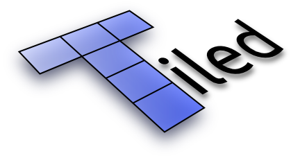
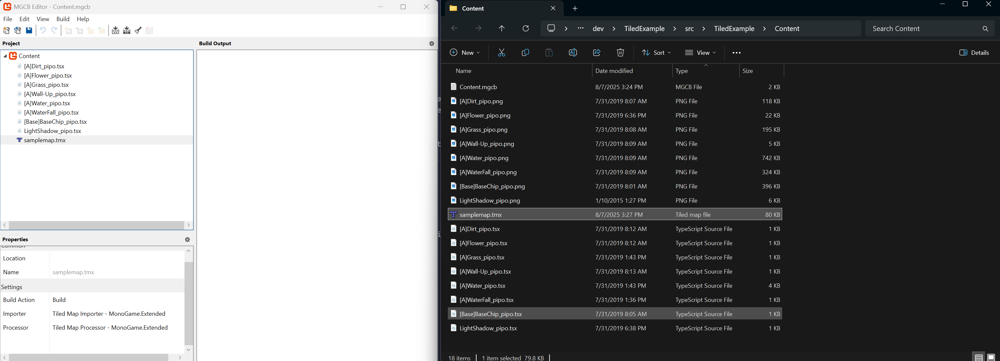
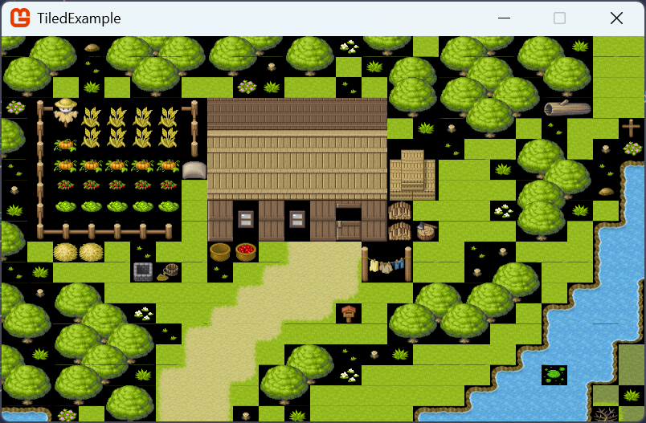
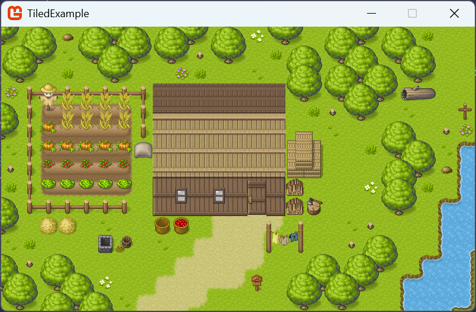

:::tip[Up to date]
This page is **up to date** for MonoGame.Extended `@mgeversion@`.  If you find outdated information, [please open an issue](https://github.com/monogame-extended/monogame-extended.github.io/issues).
:::

[](https://www.mapeditor.org/)

## Tiled

The `MonoGame.Extended.Tiled` namespace allows you to load and render map files (`.tmx`) created with the [Tiled Map Editor](http://www.mapeditor.org/).

## Supported Features

MonoGame.Extended Tiled support includes:

- ✅ Orthogonal and Isometric maps  
- ✅ Multiple layer types (Tile, Object, Image, Group)
- ✅ All object types (Rectangle, Ellipse, Polygon, Polyline, Tile)
- ✅ Tile animations
- ✅ Tile flipping and rotation
- ✅ External tilesets (.tsx files)
- ✅ Custom properties on maps, layers, and objects
- ✅ Image layers with positioning
- ✅ Group layers (nested layers)

## Limitations

Current limitations include:

- ❌ Hexagonal and Staggered map orientations  
- ❌ Infinite maps (chunked data)
- ❌ Wang tiles/terrain sets
- ❌ Collection of Images tilesets (use single image tilesets instead)

## Prerequisites

The following prerequisites are required when using Tiled maps with MonoGame.Extended:

- A MonoGame project with MonoGame.Extended installed.
- Content Pipeline Extensions configured (see [Installation Guide: Setup up MGC BEditor](/docs/getting-started/installation-monogame/#optional-set-up-mgcb-editor)).
- Basic understanding of the [Tiled Map Editor](https://www.mapeditor.org/docs)

## File Organization

Tiled projects consist of multiple interconnected files:

- **`.tmx` files** - The main tilemap file containing layer and map data
- **`.tsx` files** - External tileset files referenced by the tilemap  
- **`.png` files** - Image files used by the tilesets

These files use relative paths to reference each other:

- The `.tmx` file contains relative paths to `.tsx` files
- The `.tsx` files contain relative paths to `.png` image files

### Important File Management

When adding Tiled assets to your MonoGame project, you must maintain the same relative file structure that exists in your Tiled project. The MonoGame.Extended Content Pipeline reads these relative paths during processing and expects the referenced files to exist in the correct locations.

**Best Practice:** Keep all your Tiled project files (.tmx, .tsx, .png) in the same folder structure when you add them to the MGCB Editor. This ensures the relative paths remain valid during content processing.

All three file types (.tmx, .tsx, .png) must be added to the MGCB Editor for the content pipeline to process them correctly.

## Adding Files to MGCB Editor

When working with Tiled maps in MonoGame.Extended, you need to add your files to the MGCB Editor content project carefully:

### Files to Add to MGCB Editor

- **`.tmx` files** - The main tilemap files
- **`.tsx` files** - External tileset files

### Files to Copy (But Not Add)

- **`.png` files** - Tileset image files

The `.png` tileset images must be copied to your content directory maintaining the same relative path structure as your Tiled project, but they should **not** be added as content items in the MGCB Editor. The MonoGame.Extended Content Pipeline will automatically detect and process these images when it processes the `.tsx` files that reference them.

For reference, here are the assets from the demo files setup in the MGCB Editor and what it looks like in the directory structure



### Step-by-Step Process

1. **Copy your entire Tiled project folder** to your MonoGame Content directory, maintaining the folder structure
2. **Add only the .tmx and .tsx files** to the MGCB Editor content project
3. **Leave the .png files** in the content directory but do not add them to the MGCB Editor
4. **Build your content project** - the pipeline will automatically process the referenced .png files

## Usage

:::info
The assets used in this example can be downloaded <a href="/downloads/tiledmap-assets.zip" download>here</a>
:::

### Setting up Namespaces

Start by including the required Tiled namespaces:

```cs
using MonoGame.Extended.Tiled;
using MonoGame.Extended.Tiled.Renderers;
```

### Loading and Rendering a Map

Define your TiledMap and TiledMapRenderer fields:

```cs
private TiledMap _tiledMap;
private TiledMapRenderer _tiledMapRenderer;
```

Initialize them in the `LoadContent` method:

```cs
protected override void LoadContent()
{
    _tiledMap = Content.Load<TiledMap>("samplemap");
    _tiledMapRenderer = new TiledMapRenderer(GraphicsDevice, _tiledMap);

    _spriteBatch = new SpriteBatch(GraphicsDevice);
}
```

Update and draw the map:

```cs
protected override void Update(GameTime gameTime)
{
    _tiledMapRenderer.Update(gameTime);
    
    base.Update(gameTime);
}

protected override void Draw(GameTime gameTime)
{
    GraphicsDevice.Clear(Color.Black);
    
    _tiledMapRenderer.Draw();
    
    base.Draw(gameTime);
}
```

### Transparency Rendering Issue

If you run the game now using the demo assets, you'll notice a rendering issue where tiles that should have transparent backgrounds appear with black backgrounds instead. 



This happens because the `TiledMapRenderer` operates directly on the `GraphicsDevice` and doesn't automatically set the proper blend state for transparency.

Unlike `SpriteBatch`, which manages its own rendering state, `TiledMapRenderer` relies on the current `GraphicsDevice` state. By default, the graphics device uses `BlendState.Opaque`, which doesn't handle transparency correctly, causing transparent pixels to render as black.

To fix this, we need to set the proper blend state before drawing the map:

```cs
protected override void Draw(GameTime gameTime)
{
    GraphicsDevice.Clear(Color.Black);
    
    // Save current blend state and set to AlphaBlend for proper transparency
    BlendState previousBlendState = GraphicsDevice.BlendState;
    GraphicsDevice.BlendState = BlendState.AlphaBlend;
    
    _tiledMapRenderer.Draw();
    
    // Restore previous blend state
    GraphicsDevice.BlendState = previousBlendState;
    
    base.Draw(gameTime);
}
```

Now when you run the game, transparent areas should render correctly without the black backgrounds.



## Adding Camera Support

For maps larger than your screen, you'll want to add camera support for navigation.

### Camera Setup

Include the camera namespaces:

```cs
using MonoGame.Extended;
using MonoGame.Extended.ViewportAdapters;
```

Add camera fields:

```cs
private OrthographicCamera _camera;
private Vector2 _cameraPosition;
```

Initialize the camera in `Initialize`:

```cs
protected override void Initialize()
{
    BoxingViewportAdapter viewportAdapter = new BoxingViewportAdapter(Window, GraphicsDevice, 800, 600);
    _camera = new OrthographicCamera(viewportAdapter);

    // Set initial camera position to show map from top-left
    _cameraPosition = _camera.Origin;
    _camera.LookAt(_cameraPosition);
    
    base.Initialize();
}
```

### Viewport Adapter Options

MonoGame.Extended provides several viewport adapter types for different scaling needs:

- **`BoxingViewportAdapter`** - Maintains aspect ratio with letterboxing/pillarboxing (recommended for most games)
- **`DefaultViewportAdapter`** - Uses the current graphics device viewport as-is  
- **`ScalingViewportAdapter`** - Stretches to fill the entire screen (may distort aspect ratio)
- **`WindowViewportAdapter`** - Adapts to window size changes

For Tiled maps, `BoxingViewportAdapter` is typically the best choice as it maintains proper aspect ratios while handling different screen sizes.

### Camera Movement

Add camera movement methods:

```cs
private Vector2 GetMovementDirection()
{
    Vector2 movementDirection = Vector2.Zero;
    KeyboardState state = Keyboard.GetState();

    if (state.IsKeyDown(Keys.Down))
    {
        movementDirection += Vector2.UnitY;
    }

    if (state.IsKeyDown(Keys.Up))
    {
        movementDirection -= Vector2.UnitY;
    }

    if (state.IsKeyDown(Keys.Left))
    {
        movementDirection -= Vector2.UnitX;
    }

    if (state.IsKeyDown(Keys.Right))
    {
        movementDirection += Vector2.UnitX;
    }

    // Normalize to prevent faster diagonal movement
    if (movementDirection != Vector2.Zero)
    {
        movementDirection.Normalize();
    }

    return movementDirection;
}

private void MoveCamera(GameTime gameTime)
{
    float speed = 200f;
    float deltaTime = (float)gameTime.ElapsedGameTime.TotalSeconds;
    Vector2 movementDirection = GetMovementDirection();

    _cameraPosition += speed * movementDirection * deltaTime;
}
```

### Using the Camera

Update your `Update` and `Draw` methods to use the camera:

```cs
protected override void Update(GameTime gameTime)
{
    _tiledMapRenderer.Update(gameTime);
    
    MoveCamera(gameTime);
    _camera.LookAt(_cameraPosition);

    base.Update(gameTime);
}

protected override void Draw(GameTime gameTime)
{
    GraphicsDevice.Clear(Color.Black);

    _tiledMapRenderer.Draw(_camera.GetViewMatrix());
    
    base.Draw(gameTime);
}
```

## Working with Layers

TiledMap provides access to different layer types:

### Getting Layers

```cs
// Get a layer by name
TiledMapLayer backgroundLayer = _tiledMap.GetLayer("Background");

// Get a specific layer type
TiledMapTileLayer tileLayer = _tiledMap.GetLayer<TiledMapTileLayer>("Ground");
TiledMapObjectLayer objectLayer = _tiledMap.GetLayer<TiledMapObjectLayer>("Collision");
TiledMapImageLayer imageLayer = _tiledMap.GetLayer<TiledMapImageLayer>("Parallax Background");
```

### Layer Collections

Access collections of specific layer types:

```cs
// All layers
foreach (TiledMapLayer layer in _tiledMap.Layers)
{
    Console.WriteLine($"Layer: {layer.Name}, Type: {layer.GetType().Name}");
}

// Only tile layers  
foreach (TiledMapTileLayer tileLayer in _tiledMap.TileLayers)
{
    Console.WriteLine($"Tile Layer: {tileLayer.Name}");
}

// Only object layers
foreach (TiledMapObjectLayer objectLayer in _tiledMap.ObjectLayers)
{
    Console.WriteLine($"Object Layer: {objectLayer.Name}");
}
```

## Working with Tiles

### Accessing Individual Tiles

```cs
TiledMapTileLayer tileLayer = _tiledMap.GetLayer<TiledMapTileLayer>("Ground");

// Get tile at specific coordinates
if (tileLayer.TryGetTile(10, 5, out TiledMapTile? tile))
{
    if (tile.HasValue && !tile.Value.IsBlank)
    {
        Console.WriteLine($"Tile Global ID: {tile.Value.GlobalIdentifier}");
        Console.WriteLine($"Flipped Horizontally: {tile.Value.IsFlippedHorizontally}");
    }
}
```

### Working with Tilesets

```cs
// Get tileset for a specific tile
TiledMapTileset tileset = _tiledMap.GetTilesetByTileGlobalIdentifier(tile.Value.GlobalIdentifier);
if (tileset != null)
{
    Console.WriteLine($"Tileset: {tileset.Name}");

    // Get local tile ID within the tileset
    int firstGid = _tiledMap.GetTilesetFirstGlobalIdentifier(tileset);
    int localId = tile.Value.GlobalIdentifier - firstGid;
}
```

## Working with Objects

### Accessing Object Layers

```cs
TiledMapObjectLayer objectLayer = _tiledMap.GetLayer<TiledMapObjectLayer>("Enemies");

foreach (TiledMapObject mapObject in objectLayer.Objects)
{
    Console.WriteLine($"Object: {mapObject.Name} at ({mapObject.Position.X}, {mapObject.Position.Y})");

    // Check object type
    switch (mapObject)
    {
        case TiledMapRectangleObject rectangle:
            Console.WriteLine($"Rectangle: {rectangle.Size.Width} x {rectangle.Size.Height}");
            break;

        case TiledMapEllipseObject ellipse:
            Console.WriteLine($"Ellipse: Center {ellipse.Center}, Radius {ellipse.Radius}");
            break;

        case TiledMapPolygonObject polygon:
            Console.WriteLine($"Polygon with {polygon.Points.Length} points");
            break;

        case TiledMapTileObject tileObject:
            Console.WriteLine($"Tile Object using tileset: {tileObject.Tileset.Name}");
            break;
    }
}
```

## Working with Properties

Both maps and individual objects support custom properties:

### Map Properties

```cs
// Access map-level properties
if (_tiledMap.Properties.TryGetValue("gravity", out string gravityValue))
{
    float gravity = float.Parse(gravityValue);
    Console.WriteLine($"Map gravity: {gravity}");
}
```

### Object Properties

```cs
// Access object properties
foreach (TiledMapObject mapObject in objectLayer.Objects)
{
    if (mapObject.Properties.TryGetValue("health", out string healthValue))
    {
        int health = int.Parse(healthValue);
        Console.WriteLine($"Object {mapObject.Name} has {health} health");
    }
}
```

## Map Information

Access basic map information:

```cs
Console.WriteLine($"Map Size: {_tiledMap.Width} x {_tiledMap.Height} tiles");
Console.WriteLine($"Tile Size: {_tiledMap.TileWidth} x {_tiledMap.TileHeight} pixels");
Console.WriteLine($"Map Size in Pixels: {_tiledMap.WidthInPixels} x {_tiledMap.HeightInPixels}");
Console.WriteLine($"Orientation: {_tiledMap.Orientation}");
Console.WriteLine($"Render Order: {_tiledMap.RenderOrder}");

if (_tiledMap.BackgroundColor.HasValue)
{
    Console.WriteLine($"Background Color: {_tiledMap.BackgroundColor.Value}");
}
```

## Performance Optimization

### Tileset Organization

The way you organize your tilesets in Tiled can significantly impact rendering performance. For optimal performance:

- **Use fewer, larger tilesets** rather than many small ones
- **Combine related tiles** into single tileset images when possible
- **Avoid excessive tileset switching** during rendering

Each tileset requires a separate texture binding operation during rendering. Having many small tilesets forces the renderer to switch textures frequently, which can create performance bottlenecks.

### Managing Layer Visibility

You can control which layers are rendered to improve performance in areas where not all content needs to be visible:

```cs
TiledMapLayer backgroundLayer = _tiledMap.GetLayer("Background");
backgroundLayer.IsVisible = false; // This layer won't be rendered

// Later, you can re-enable it
backgroundLayer.IsVisible = true;
```

This is particularly useful for:

- Debug layers that shouldn't be visible in release builds
- Layers that are only relevant in certain game states
- Background layers that might be obscured by foreground content

### Animated Tile Updates

The `TiledMapRenderer.Update()` method is specifically for processing animated tiles. If your map doesn't contain any animated tiles, you can skip calling this method entirely:

```cs
protected override void Update(GameTime gameTime)
{
    // Only call this if you have animated tiles in your map
    if (HasAnimatedTiles)
    {
        _tiledMapRenderer.Update(gameTime);
    }
        
    base.Update(gameTime);
}
```

### Automatic Optimizations

MonoGame.Extended includes several built-in optimizations that work automatically:

- **Camera-based culling**: Only tiles visible within the camera's view are rendered, regardless of map size
- **Efficient vertex batching**: Tiles are batched together to minimize draw calls
- **Texture atlasing**: Multiple tiles from the same tileset are rendered in a single draw operation

## Troubleshooting

### Content Pipeline Issues

**Problem**: "Could not find ContentTypeReader" error.  
**Solution**: Ensure MonoGame.Extended.Content.Pipeline is added to your MGCB Editor references.  If you did not use the `<MonoGameExtendedPipelineReferencePath>` method as described in the [Installation Guide: Setup up MGC BEditor](/docs/getting-started/installation-monogame/#optional-set-up-mgcb-editor) and instead added the dll directly from the NuGet download directory, ensure it is the `.dll` found in the `tools` directory of the NuGet package, not the one in the `lib` directory.

**Problem**: "File not found" errors during content processing.  
**Solution**: Verify all .tmx, .tsx, and .png files are added to the MGCB Editor and maintain proper relative paths.  

### Runtime Issues

**Problem**: Map renders incorrectly or tiles are missing.  
**Solution**: Check that all required tileset images are included in your content project and have been processed by the pipeline.  

**Problem**: Poor performance with large maps.  
**Solution**: Consider using fewer, larger tilesets and ensure you're only updating animated tiles when necessary.  
